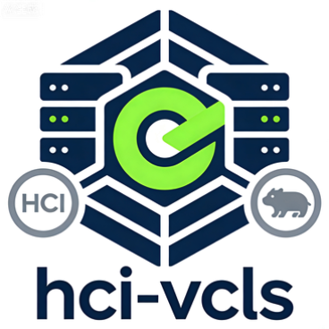

## README-zh.md

<div align="center">
  

  # hci-vcls

  [](https://github.com/turtacn/hci-vcls/actions)
  [](https://goreportcard.com/report/github.com/turtacn/hci-vcls)
  [](LICENSE)
  [](https://golang.org/)
  [](https://github.com/turtacn/hci-vcls/releases)
  [](README.md)

  面向 HCI 集群的少数派 HA 解决方案 —— 以 vCenter + vCLS 解耦架构为参照，服务于真实生产场景。
</div>

---

> 本文档同时提供 [英文版（English）](README.md)。

---

## 项目使命

HCI 集群在控制平面法定人数丢失时，往往陷入静默失效的困境。
`hci-vcls` 赋予每一个存活节点自主探测故障、维护本地 HA 元数据缓存、并在无需等待 ZooKeeper、CFS 或 MySQL 恢复的前提下重启受保护虚拟机的能力。

本项目以 VMware vCenter + vCLS 解耦设计哲学为参照，将集群服务的存活能力从管控平面的可用性中彻底剥离，以轻量级、可嵌入的 Go 库和守护进程的形式，无缝集成到基于 Proxmox VE 的现有 HCI 技术栈之中。

---

## 为什么选择 hci-vcls？

| 问题场景          | 当前系统的失效表现            | hci-vcls 的应对方式                 |
| ------------- | -------------------- | ------------------------------ |
| ZK 少数派分区      | HA 调度被 ZK 写锁阻断，无法触发  | FDM agent 独立运行，本地缓存驱动 qm start |
| CFS 只读        | VM 配置不可读，HA 无法确定目标节点 | 快照缓存提供最后已知的 VM 配置              |
| MySQL 不可用     | 调度器无法提交状态转换          | 解耦后的开机路径对幂等启动绕过 MySQL 写依赖      |
| svc-master 离线 | 无仲裁者进行 VM 调度决策       | vCLS 等效代理在每个故障域内独立选主           |
| 双节点集群         | 任意单节点故障即破坏 Quorum    | 非对称 ZK 权重 + 见证节点集成路径           |
| 静默失效          | 运维人员对降级状态无感知         | 显式状态机，可观测的降级等级                 |

---

## 核心功能特性

* 故障域监控守护进程（FDM Daemon），具备 L1 UDP 网络心跳和 L2 存储心跳能力，独立于 ZK/CFS/MySQL 健康状态运行。
* 每计算节点部署 FDM Agent，具备自主 Leader 选举能力（基于 Raft-lite，无 ZK 依赖）。
* 本地 HA 元数据快照缓存：将虚拟机 HA 配置持久化至节点本地存储，在集群文件系统不可用时仍可读取。
* 少数派 Quorum 开机路径：当 ZK 处于只读少数派状态且 MySQL 主库直接可达时，通过幂等 qm start 启动受保护虚拟机，并结合 MySQL 层乐观锁防止双启动。
* vCLS 等效集群服务层：将集群健康信号与管控平面可用性解耦。
* 显式降级状态机：每个节点清晰感知当前降级等级（NORMAL / ZK_RO / CFS_RO / MYSQL_UNAVAIL / ISOLATED），并据此采取对应行动。
* 核心 HA 路径零外部依赖：无需 etcd、Consul 或任何附加基础设施。
* 可插拔见证节点集成：为双节点和跨机房延伸集群拓扑提供可选的 ZK 见证节点支持。
* 全面可观测性：Prometheus 指标、结构化 JSON 日志与 gRPC 状态 API。

---

## 架构概览

完整架构设计、组件详解与时序图请参阅 [docs/architecture.md](docs/architecture.md)。

高层次分层示意：

```text
+----------------------------------------------------------+
|                  hci-vcls 守护进程                        |
|                                                          |
|  +----------------+   +----------------+                |
|  |  vCLS Agent    |   |  FDM Daemon    |                |
|  |  （集群级别）   |   |  （节点级别）  |                |
|  +-------+--------+   +-------+--------+                |
|          |                    |                          |
|  +-------v--------------------v--------+                |
|  |        集群状态机                    |                |
|  |  NORMAL / ZK_RO / CFS_RO /         |                |
|  |  MYSQL_UNAVAIL / ISOLATED           |                |
|  +-------+-----------------------------+                |
|          |                                              |
|  +-------v-----------------------------------------+   |
|  |           HA 执行引擎                            |   |
|  |  快照缓存 | 少数派开机 | qm 适配器               |   |
|  +-------------------------------------------------+   |
+----------------------------------------------------------+
        |                  |                  |
   ZooKeeper           pmxcfs / CFS        MySQL
   （可选）             （可选）            （可选）
```

---

## 快速开始

### 环境要求

* Go 1.21 及以上版本
* Proxmox VE 7.x / 8.x 节点（完整集成）或任意 Linux 主机（测试用途）
* `qm` 命令行工具需在 PATH 中可用

### 安装

```shell
go install github.com/turtacn/hci-vcls/cmd/hci-vcls@latest
```

或从源码构建：

```shell
git clone https://github.com/turtacn/hci-vcls.git
cd hci-vcls
make build
# 二进制文件位于 bin/hci-vcls
```

### 快速上手

在计算节点上启动 FDM 守护进程：

```shell
hci-vcls fdm start \
  --node-id=node-01 \
  --cluster-id=hci-prod \
  --peers=192.168.1.1:7946,192.168.1.2:7946,192.168.1.3:7946 \
  --ha-meta-cache-dir=/var/lib/hci-vcls/cache \
  --zk-endpoints=192.168.1.1:2181,192.168.1.2:2181,192.168.1.3:2181
```

查询集群降级状态：

```shell
hci-vcls status --output=json
```

示例输出：

```json
{
  "node_id": "node-01",
  "cluster_id": "hci-prod",
  "degradation_level": "ZK_RO",
  "zk_state": "minority_read_only",
  "cfs_state": "read_only",
  "mysql_state": "primary_reachable",
  "ha_capable": true,
  "protected_vms": 12,
  "cache_age_seconds": 47
}
```

测试少数派模式下的 HA 开机（演练模式）：

```shell
hci-vcls ha boot --vm-id=101 --dry-run
```

---

## 代码示例：嵌入 FDM Agent

```go
package main

import (
    "context"
    "log/slog"
    "os"

    "github.com/turtacn/hci-vcls/pkg/fdm"
    "github.com/turtacn/hci-vcls/pkg/cache"
    "github.com/turtacn/hci-vcls/pkg/ha"
)

func main() {
    logger := slog.New(slog.NewJSONHandler(os.Stdout, nil))

    // 初始化本地快照缓存
    cacheStore, err := cache.NewLocalSnapshotStore(cache.Config{
        Dir:             "/var/lib/hci-vcls/cache",
        MaxAgeSeconds:   300,
        CompressEnabled: true,
    })
    if err != nil {
        logger.Error("快照缓存初始化失败", "err", err)
        os.Exit(1)
    }

    // 初始化 FDM Agent
    agent, err := fdm.NewAgent(fdm.AgentConfig{
        NodeID:    "node-01",
        ClusterID: "hci-prod",
        Peers:     []string{"192.168.1.2:7946", "192.168.1.3:7946"},
        Logger:    logger,
        Cache:     cacheStore,
    })
    if err != nil {
        logger.Error("FDM Agent 初始化失败", "err", err)
        os.Exit(1)
    }

    // 初始化少数派 HA 执行引擎
    engine, err := ha.NewMinorityBootEngine(ha.EngineConfig{
        Agent:     agent,
        Cache:     cacheStore,
        QMAdapter: ha.NewQMAdapter("/usr/sbin/qm"),
        Logger:    logger,
    })
    if err != nil {
        logger.Error("HA 执行引擎初始化失败", "err", err)
        os.Exit(1)
    }

    ctx := context.Background()
    if err := engine.RunProtectedVMs(ctx); err != nil {
        logger.Error("少数派 HA 开机失败", "err", err)
        os.Exit(1)
    }
}
```

---

## 项目目录结构

```text
hci-vcls/
├── cmd/hci-vcls/          # CLI 入口（Cobra）
├── pkg/
│   ├── fdm/               # 故障域监控守护进程与 Agent
│   ├── vcls/              # vCLS 等效集群服务层
│   ├── ha/                # HA 执行引擎与少数派开机
│   ├── cache/             # 本地 HA 元数据快照缓存
│   ├── statemachine/      # 集群降级状态机
│   ├── zk/                # ZooKeeper 适配器与 Quorum 探针
│   ├── mysql/             # MySQL 适配器与开机路径解耦
│   ├── cfs/               # CFS/pmxcfs 适配器
│   ├── qm/                # qm CLI 适配器（VM 生命周期）
│   ├── witness/           # 可选见证节点集成
│   ├── metrics/           # Prometheus 指标
│   └── api/               # gRPC + REST 状态 API
├── internal/
│   ├── election/          # Raft-lite Leader 选举
│   ├── heartbeat/         # L1 UDP 心跳 + L2 存储心跳
│   └── logger/            # 结构化日志初始化
├── docs/
│   ├── architecture.md    # 架构设计文档
│   └── apis.md            # API 详细设计文档
└── test/e2e/              # 端到端测试套件
```

---

## 贡献指南

我们热诚欢迎各类贡献。`hci-vcls` 是一个极具挑战性的项目，尤其欢迎在真实 HCI 集群上有运维经验的工程师参与。

参与方式：

1. 阅读 [docs/architecture.md](docs/architecture.md) 了解核心设计原则。
2. 在编写代码之前，先提 Issue 讨论您的改进方案。
3. Fork 本仓库并创建功能分支。
4. 编写测试。每个 PR 必须包含单元测试；涉及行为变更时需提供 E2E 测试。
5. 提交前运行 `make lint && make test`。
6. 提交 Pull Request，并附上清晰的变更说明。

请遵守贡献者公约行为准则。
完整贡献指南请参阅 [CONTRIBUTING.md](CONTRIBUTING.md)。

---

## 开源许可证

版权所有 2024 turtacn 贡献者。

本项目采用 Apache License 2.0 开源许可证。
完整许可证文本请参阅 [LICENSE](LICENSE)。