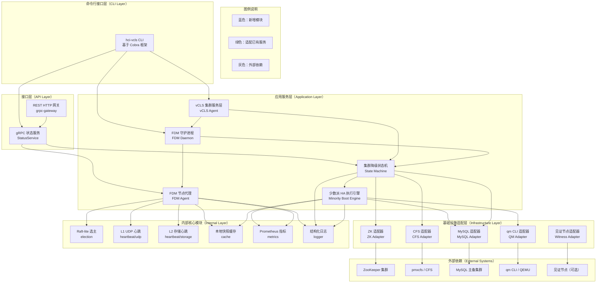
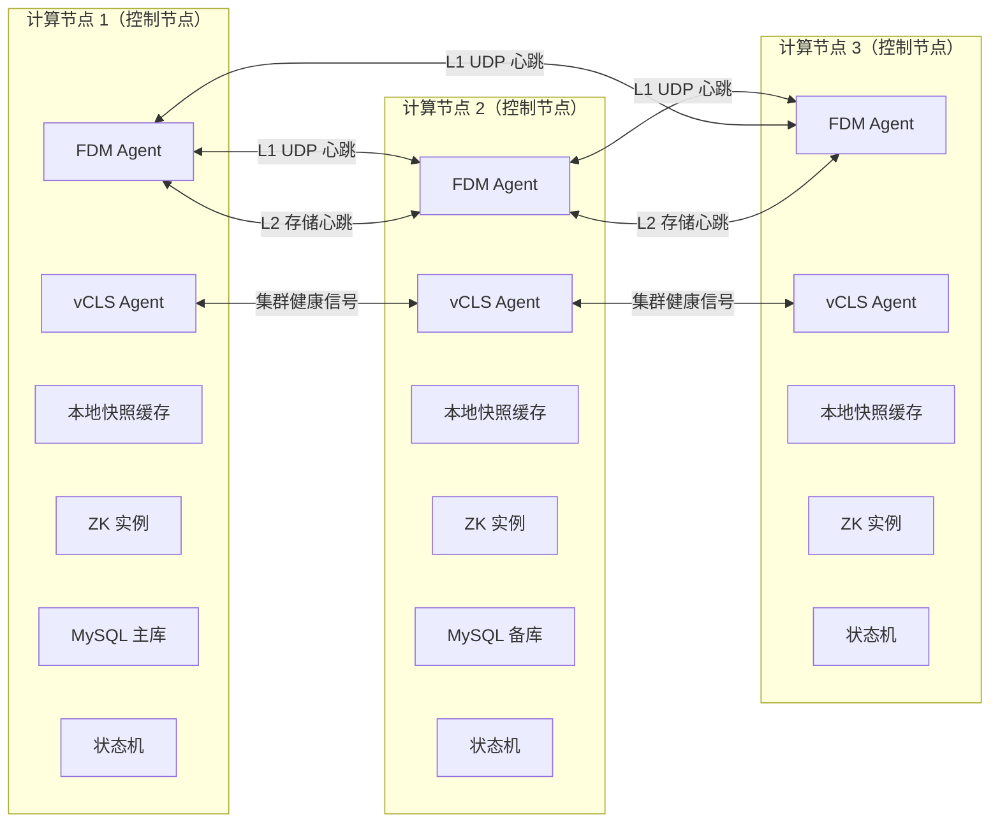
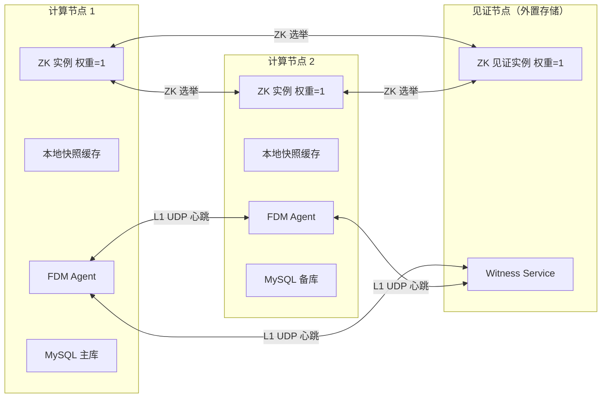
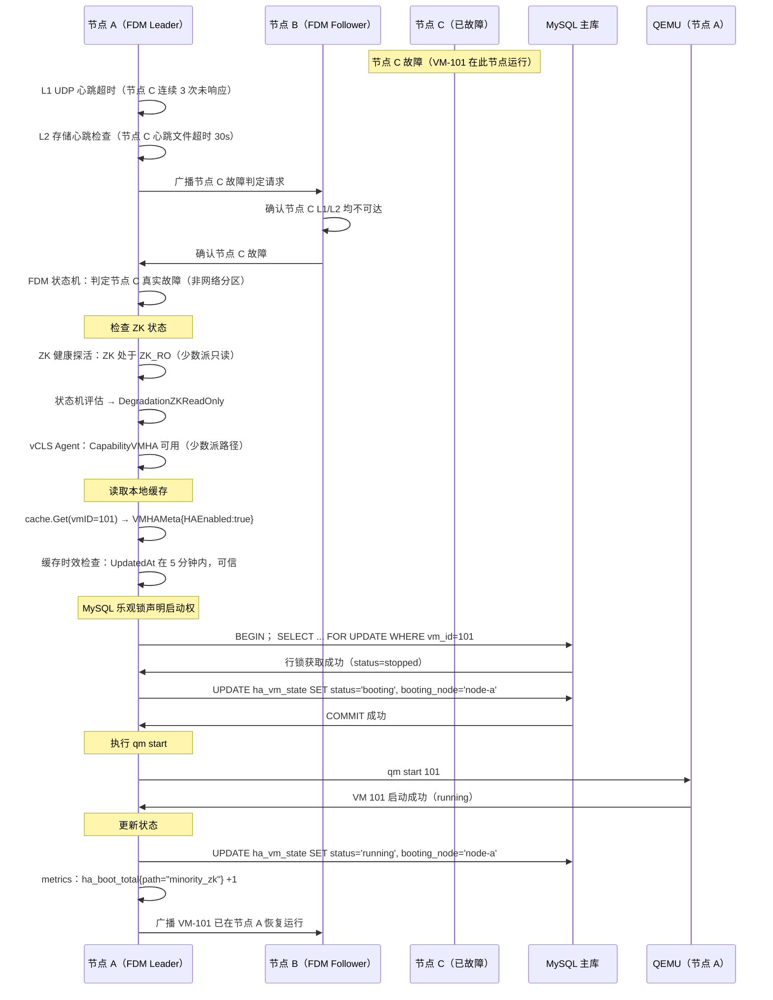
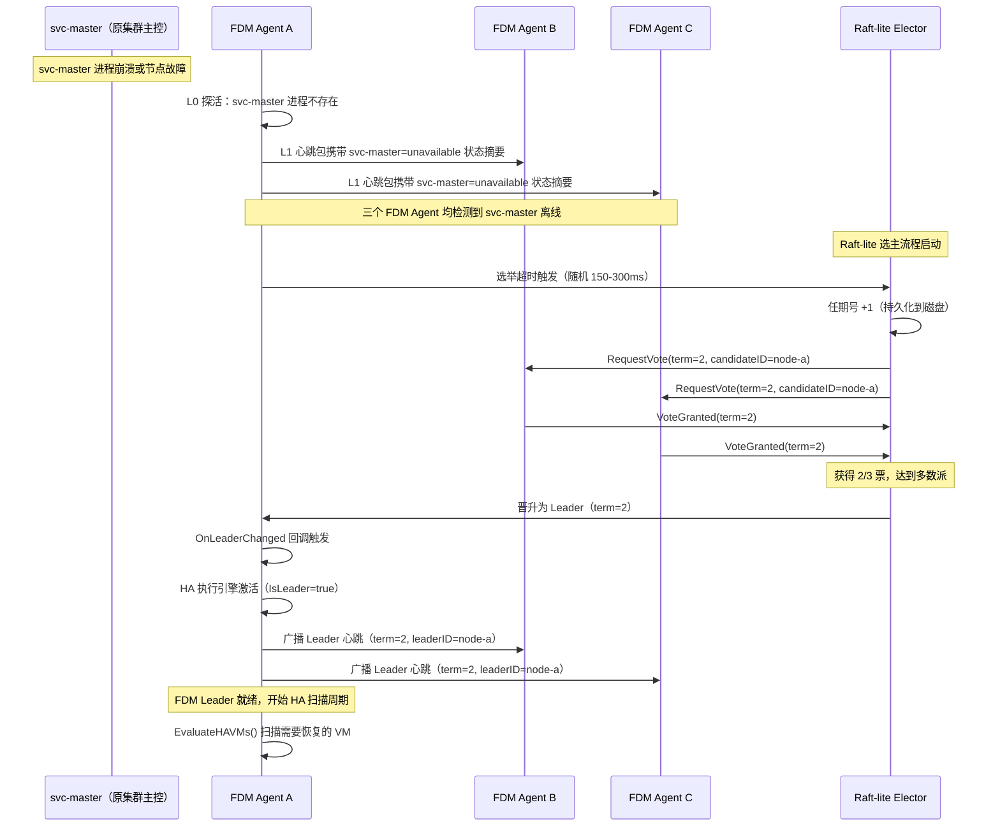
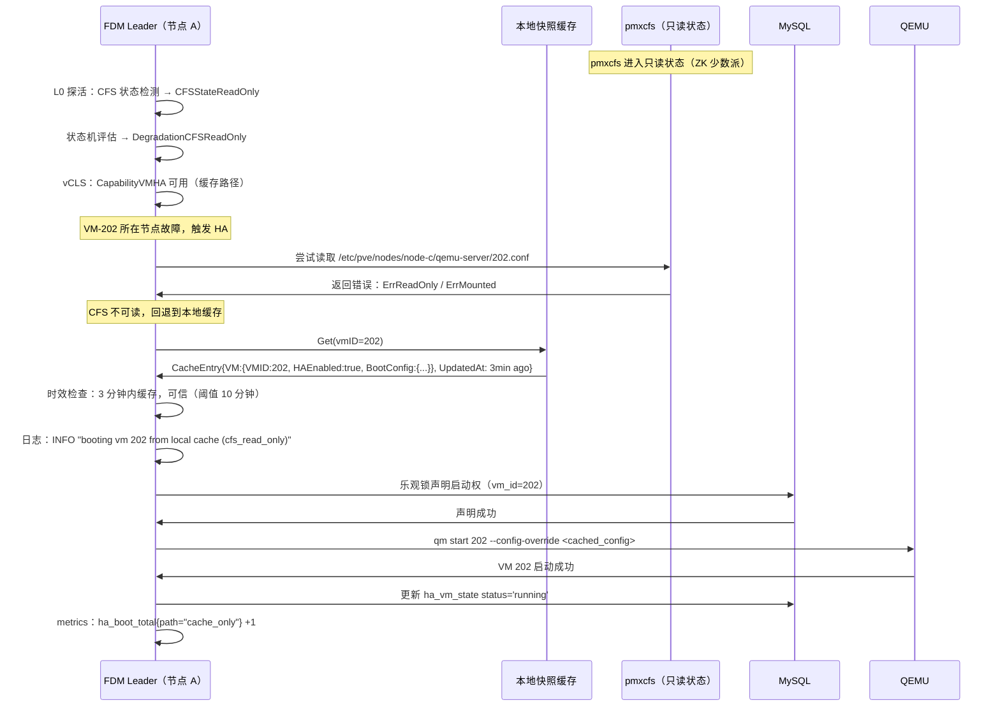
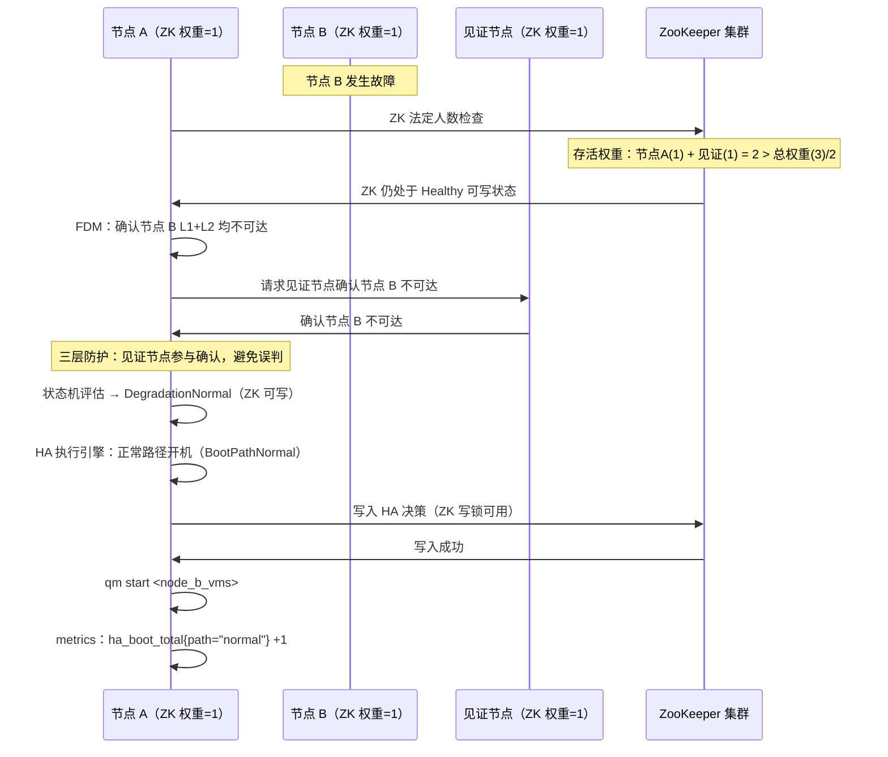
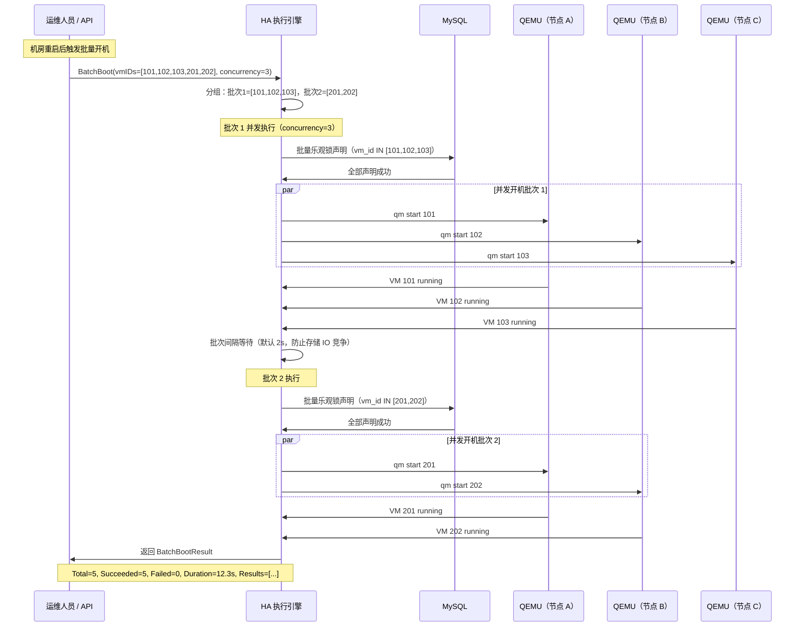

# hci-vcls 总体架构设计文档

版本：v0.1.0
状态：草稿
最后更新：2026-03

---

## 目录

1. 概述与背景
2. DFX 问题全景
3. 解决方案全景
4. 预期效果全景与展望
5. 核心设计原则
6. 系统架构
   * 6.1 架构分层
   * 6.2 模块依赖关系
   * 6.3 部署拓扑
7. 核心组件详细设计
   * 7.1 FDM Daemon 与 FDM Agent
   * 7.2 vCLS 等效集群服务层
   * 7.3 集群降级状态机
   * 7.4 本地 HA 元数据快照缓存
   * 7.5 少数派 HA 执行引擎
   * 7.6 内部 Raft-lite 选主模块
   * 7.7 L1/L2 心跳模块
   * 7.8 适配器层
   * 7.9 可观测性模块
8. 关键业务场景详细设计
   * 8.1 ZK 少数派场景下的 VM HA 全流程
   * 8.2 svc-master 离线场景下的 FDM 自主选主
   * 8.3 CFS 只读场景下的缓存驱动开机
   * 8.4 双节点集群的非对称 Quorum 保护
   * 8.5 正常模式下的快速批量开机
9. 计算、网络、存储本地化缓存框架
10. 项目完整目录结构
11. 源文件生成计划
12. 参考资料

---

## 1. 概述与背景

hci-vcls 项目源于对真实 HCI 生产环境中控制平面失效问题的深度分析。现有基于Proxmox VE 的 HCI 集群将 ZooKeeper（ZK）、pmxcfs（CFS）、MySQL 和 HAService
紧密耦合于同一控制平面，形成了一个脆弱的共同命运组合：任意组件进入不健康状态，整个 HA 调度链路即告中断。

本项目以 VMware vCenter + vCLS 架构的解耦设计为参照系，系统性地回答以下核心工程问题：

在 ZK 处于少数派只读状态、CFS 不可写、MySQL 主库离线等任意组合的降级场景下，集群中存活的计算节点能否自主完成受保护 VM 的 HA 重启？

答案是肯定的——前提是将"集群服务存活能力"从管控平面可用性中解耦，并在每个计算节点上部署具备本地决策能力的轻量级代理。这正是 hci-vcls 所做的事情。

---

## 2. DFX 问题全景

DFX（Dependability / Failure / eXperience）问题全景从三个维度展开：可靠性问题、失效模式和运维体验问题。

### 2.1 可靠性问题（Dependability）

D-01  ZK 少数派导致写锁不可用，HA 调度链路完全中断。

D-02  CFS 只读状态下 VM 配置不可读，HA 目标节点无法确定。

D-03  MySQL 主库离线时，状态提交路径断裂，VM 开机事务无法完成。

D-04  svc-master 离线后无等效替代，HAServer 无法接管。

D-05  双节点集群中任意单节点故障即破坏 Quorum，集群进入静默失效。

D-06  控制节点集中故障（2/3 节点同时掉线）时无任何自愈手段。

D-07  现有 HA 链路对 ZK/CFS/MySQL 三者的健康状态存在强依赖，缺乏降级运行能力。

### 2.2 失效模式（Failure Modes）

F-01  失败模式一：ZK 全挂 + MySQL 全挂，系统完全失去自愈能力。

F-02  失败模式二：ZK 少数派（可读不可写），HA 调度被软性阻断。

F-03  失败模式三：CFS 只读，VM 配置不可达，开机前置检查失败。

F-04  失败模式四：MySQL 主库离线，备库未完成升主，写路径不可用。

F-05  失败模式五：网络分区导致节点孤岛化，节点不知自身是否处于多数派侧。

F-06  失败模式六：脑裂（Split-Brain），多节点并发尝试启动同一 VM。

### 2.3 运维体验问题（eXperience）

X-01  降级状态不可观测，运维人员无法感知集群当前处于何种失效模式。

X-02  手动恢复流程缺乏标准化，依赖运维人员经验，RTO 差异巨大。

X-03  无法区分"节点真实故障"与"节点网络分区"，导致过激或保守的 HA 决策。

X-04  缺乏演练机制，故障预案在真实事件前从未被验证。

X-05  批量开机场景（如机房整体重启后）缺乏协调机制，并发 qm start 导致资源竞争。

---

## 3. 解决方案全景

hci-vcls 通过以下六个解决方案层次系统性地解决上述问题：

S-01  FDM 三层心跳架构（L0 本地探活 / L1 UDP 网络心跳 / L2 存储心跳），独立于ZK/CFS/MySQL 判定节点存活状态，解决 F-05 和 X-03。

S-02  FDM Agent 独立 Raft-lite 选主，在 ZK 不可用时自主产生集群内 HA 决策主节点，解决 D-04 和 F-02。

S-03  本地 HA 元数据快照缓存，将 VM HA 配置定期持久化到节点本地，在 CFS 只读或ZK 少数派时仍可驱动开机决策，解决 D-02、D-03 和 F-03。

S-04  少数派开机路径（Minority Boot Path），当 ZK 处于只读少数派但 MySQL 主库直接可达时，通过 MySQL 乐观锁保证幂等性，绕过 ZK 写锁依赖完成 VM 启动，解决 D-01、F-02 和 F-06。

S-05  显式集群降级状态机，将集群状态形式化为五个降级等级（NORMAL / ZK_RO / CFS_RO / MYSQL_UNAVAIL / ISOLATED），每个等级对应明确的 HA 能力边界和行动策略，解决 X-01 和 X-02。

S-06  可观测性与演练框架，提供 Prometheus 指标、结构化日志、gRPC 状态 API 和 dry-run 演练模式，解决 X-01、X-04 和 X-05。

---

## 4. 预期效果全景与展望

### 4.1 量化预期效果

| 指标               | 改善前（当前状态）           | 改善后（hci-vcls）               |
| ---------------- | ------------------- | --------------------------- |
| ZK 少数派场景 RTO     | 无自动恢复，人工介入 20-40 分钟 | 约 3 分钟（自动）                  |
| CFS 只读场景 RTO     | 无自动恢复，人工介入 20-40 分钟 | 约 3 分钟（缓存驱动）                |
| MySQL 主库离线场景 RTO | 约 1-3 分钟（需 ZK 可写）   | 约 3 分钟（解耦路径）                |
| 双节点集群单节点故障 RTO   | 无自动恢复               | 约 3 分钟（见证节点路径）              |
| 批量开机（50 VM）      | 无协调，串行执行约 10 分钟     | 并发协调，约 2 分钟                 |
| 降级状态可观测性         | 无                   | 实时 Prometheus 指标 + gRPC API |

### 4.2 中长期展望

V1.0（当前规划范围）：

* 完整 FDM + vCLS 解耦架构实现
* 少数派开机路径
* 本地快照缓存
* 基础 Prometheus 可观测性

V2.0（规划中）：

* 控制平面服务容器化支持（将 ZK/MySQL 实例调度至任意存活节点）
* 内置轻量化仲裁服务（类 Nutanix Witness VM）
* 跨机房延伸集群（Stretched Cluster）一键部署支持

V3.0（长期愿景）：

* FDM Agent 去中心化 HA 决策（类 ESXi FDM，无需中心化 HAServer）
* 基于机器学习的故障预测与预防性 VM 迁移

---

## 5. 核心设计原则

P-01  工程现实优先。所有模块设计基于已知真实失效场景，禁止为假想未来引入抽象层。

P-02  接口先行。pkg/ 下所有模块对外暴露接口而非具体实现。接口一旦确定视为长期契约，实现可重构，接口语义不得轻易变更。

P-03  显式失败。错误必须在最近的处理点暴露，禁止吞错。降级状态必须通过状态机显式表达，禁止隐式降级。

P-04  本地自治优先于远程协调。在网络分区场景下，节点应优先依赖本地缓存和本地决策，而非等待远程协调完成。

P-05  幂等性是安全的基础。所有 VM 开机操作必须设计为幂等的。防止双启动比快速启动更重要。

P-06  可观测性是一等公民。每个核心状态转换、每次 HA 决策、每次开机操作都必须产生可查询的指标和结构化日志。

---

## 6. 系统架构

### 6.1 架构分层



### 6.2 模块依赖关系

模块间依赖规则：
- 上层模块可以依赖下层模块，禁止反向依赖。
- 同层模块间通过接口（interface）依赖，禁止直接引用具体类型。
- internal/ 下的模块仅供 pkg/ 内部使用，禁止在 cmd/ 中直接引用 internal/。
- pkg/ 下各模块禁止循环依赖，由 golangci-lint 的 depguard 规则强制检查。

```text
依赖层次（从上到下）：
cmd/hci-vcls
    └── pkg/api
    └── pkg/vcls
    └── pkg/fdm
    └── pkg/statemachine
    └── pkg/ha
    └── pkg/cache
    └── pkg/qm
    └── pkg/mysql
    └── pkg/zk
    └── pkg/cfs
    └── pkg/mysql
    └── pkg/witness
    └── pkg/metrics
    └── internal/election
    └── internal/heartbeat
    └── internal/logger
````

### 6.3 部署拓扑

#### 三节点标准集群部署



#### 双节点 + 见证节点部署



---

## 7. 核心组件详细设计

### 7.1 FDM Daemon 与 FDM Agent

FDM（Fault Domain Monitor）是 hci-vcls 的核心感知组件，直接对标 VMware ESXi 中的 FDM（Fault Domain Manager）。与 VMware 实现不同的是，hci-vcls 的 FDM 被设计为独立的用户态 Go 守护进程，可以在任意 Linux 节点上运行，不依赖特定 hypervisor。

#### FDM 三层心跳架构

```text
L0 本地探活（Local Probing）
  - 目标：探测本地服务（ZK、CFS、MySQL、qm）的健康状态
  - 机制：本地 Unix Socket 探活 + 进程存活检查
  - 频率：每 5 秒一次
  - 依赖：无外部依赖

L1 网络心跳（Network Heartbeat，UDP）
  - 目标：探测对等节点的网络可达性
  - 机制：UDP 单播心跳包，携带节点状态摘要（State Digest）
  - 端口：7946（可配置）
  - 频率：每 1 秒一次
  - 超时：连续 3 次未收到心跳（3 秒）判定节点网络不可达
  - 依赖：UDP 网络连通

L2 存储心跳（Storage Heartbeat）
  - 目标：通过共享存储路径验证节点存活，区分"网络分区"与"节点真实故障"
  - 机制：每个节点向共享存储写入带时间戳的心跳文件
         路径：{shared_storage}/hci-vcls/heartbeat/{node_id}/hb.json
  - 频率：每 10 秒写入一次，每 15 秒读取其他节点的心跳文件
  - 超时：心跳文件时间戳超过 30 秒未更新判定节点存储不可达
  - 依赖：共享存储挂载（可选，降级时跳过）
```

#### FDM Agent 接口定义

```go
// pkg/fdm/agent.go

package fdm

import (
    "context"
    "time"
)

// NodeState 表示单个节点的综合健康状态。
// 字段顺序和命名是公开契约，不得随意修改。
type NodeState struct {
    NodeID          string        `json:"node_id"`
    ClusterID       string        `json:"cluster_id"`
    Timestamp       time.Time     `json:"timestamp"`
    L0LocalHealthy  bool          `json:"l0_local_healthy"`
    L1NetworkAlive  bool          `json:"l1_network_alive"`
    L2StorageAlive  bool          `json:"l2_storage_alive"`
    ZKState         ZKHealthState `json:"zk_state"`
    CFSState        CFSHealthState`json:"cfs_state"`
    MySQLState      MySQLHealthState`json:"mysql_state"`
    IsLeader        bool          `json:"is_leader"`
    DegradationLevel fdm.DegradationLevel `json:"degradation_level"`
    ActiveCapabilities []Capability       `json:"active_capabilities"`
    SuppressedCapabilities []Capability   `json:"suppressed_capabilities"`
}

// Capability 表示集群服务在当前降级等级下的单项能力。
type Capability string

const (
    CapabilityVMHA           Capability = "vm_ha"
    CapabilityVMSchedule     Capability = "vm_schedule"
    CapabilityVMLiveMigrate  Capability = "vm_live_migrate"
    CapabilityVMBatchBoot    Capability = "vm_batch_boot"
    CapabilityClusterRebalance Capability = "cluster_rebalance"
    CapabilityConfigWrite    Capability = "config_write"
)

// Agent 是 vCLS 等效集群服务层的核心接口。
// 负责根据当前降级等级动态调整集群服务能力边界。
type Agent interface {
    // Start 启动 vCLS Agent，监听 FDM Agent 状态变化并相应调整能力集。
    Start(ctx context.Context) error

    // ClusterServiceState 返回当前集群服务状态和能力集。
    ClusterServiceState() ClusterServiceState

    // IsCapable 检查指定能力在当前降级等级下是否可用。
    IsCapable(cap Capability) bool

    // OnDegradationChanged 注册降级等级变更回调。
    // 当降级等级发生变化时，所有注册的回调按注册顺序同步调用。
    // 回调函数必须快速返回（< 100ms），禁止在回调中执行阻塞操作。
    OnDegradationChanged(handler func(from, to fdm.DegradationLevel))
}

// 各降级等级下的能力矩阵（设计约定，由 vCLS Agent 实现强制执行）
//
// DegradationNormal（NORMAL）：
//   全部能力可用。
//
// DegradationZKReadOnly（ZK_RO）：
//   CapabilityVMHA         → 可用（通过少数派开机路径）
//   CapabilityVMSchedule   → 不可用（需要 ZK 写锁）
//   CapabilityVMLiveMigrate→ 不可用（需要 ZK 写锁）
//   CapabilityVMBatchBoot  → 可用（通过缓存驱动）
//   CapabilityClusterRebalance → 不可用
//   CapabilityConfigWrite  → 不可用
//
// DegradationCFSReadOnly（CFS_RO）：
//   CapabilityVMHA         → 可用（通过本地缓存）
//   CapabilityVMSchedule   → 不可用
//   CapabilityVMLiveMigrate→ 不可用
//   CapabilityVMBatchBoot  → 可用（通过本地缓存）
//   CapabilityClusterRebalance → 不可用
//   CapabilityConfigWrite  → 不可用
//
// DegradationMySQLUnavail（MYSQL_UNAVAIL）：
//   CapabilityVMHA         → 有限可用（幂等性依赖降级）
//   其余全部不可用
//
// DegradationIsolated（ISOLATED）：
//   全部能力不可用，节点进入隔离保护模式，不执行任何 HA 操作。
```

### 7.3 集群降级状态机

状态机是整个系统最关键的决策枢纽。它以 FDM Agent 汇报的原始健康数据为输入，输出确定性的降级等级，并触发 vCLS Agent 的能力调整和 HA 执行引擎的行动策略。

状态机设计遵循以下约束：

* 状态转换必须是确定性的：相同输入产生相同输出，无隐式判断。
* 转换条件必须基于可观测的指标，不依赖时序假设。
* 转换动作（Action）与转换条件（Guard）严格分离。
* 状态机实例是每节点独立的，节点间不共享状态机实例。

```go
// pkg/statemachine/machine.go

package statemachine

import (
    "context"
    "github.com/turtacn/hci-vcls/pkg/fdm"
)

// Transition 描述一次状态转换。
type Transition struct {
    From   fdm.DegradationLevel
    To     fdm.DegradationLevel
    Reason string
}

// Machine 是集群降级状态机的核心接口。
type Machine interface {
    // Start 启动状态机，周期性评估当前状态并触发转换。
    Start(ctx context.Context) error

    // CurrentLevel 返回当前降级等级。此方法必须并发安全。
    CurrentLevel() fdm.DegradationLevel

    // LastTransition 返回最近一次状态转换记录。
    LastTransition() Transition

    // OnTransition 注册状态转换事件监听器。
    // 每次状态转换时，所有监听器按注册顺序同步调用。
    OnTransition(handler func(t Transition))
}

// EvaluationInput 是状态机单次评估的输入快照。
// 由状态机从 FDM Agent 周期性采集，评估逻辑仅操作此快照，不直接访问外部系统。
type EvaluationInput struct {
    ZKState         fdm.ZKHealthState
    CFSState        fdm.CFSHealthState
    MySQLState      fdm.MySQLHealthState
    L1NetworkAlive  bool
    L2StorageAlive  bool
    PeerCount       int
    AliveePeerCount int
}

// Evaluate 根据输入快照计算目标降级等级。
// 此函数是纯函数（无副作用），便于单元测试。
// 降级等级决策规则（按优先级从高到低）：
//   1. L1 和 L2 心跳均不可达 → ISOLATED
//   2. ZK 不可用（非 healthy / read_only）→ ISOLATED
//   3. 存活对等节点数 < 集群总节点数的半数 → ISOLATED
//   4. MySQL 完全不可用 → MYSQL_UNAVAIL
//   5. CFS 只读或未挂载 → CFS_RO
//   6. ZK 只读（少数派）→ ZK_RO
//   7. 以上均不满足 → NORMAL
func Evaluate(input EvaluationInput) fdm.DegradationLevel {
    // 规则 1：双心跳均不可达，节点孤岛化
    if !input.L1NetworkAlive && !input.L2StorageAlive {
        return fdm.DegradationIsolated
    }
    // 规则 2：ZK 完全不可用（区别于只读）
    if input.ZKState == fdm.ZKStateUnavailable {
        return fdm.DegradationIsolated
    }
    // 规则 3：存活节点数不足半数
    if input.PeerCount > 0 && input.AliveePeerCount < (input.PeerCount/2+1) {
        return fdm.DegradationIsolated
    }
    // 规则 4：MySQL 完全不可用
    if input.MySQLState == fdm.MySQLStateUnavailable {
        return fdm.DegradationMySQLUnavail
    }
    // 规则 5：CFS 只读
    if input.CFSState == fdm.CFSStateReadOnly ||
        input.CFSState == fdm.CFSStateUnmounted {
        return fdm.DegradationCFSReadOnly
    }
    // 规则 6：ZK 少数派只读
    if input.ZKState == fdm.ZKStateReadOnly {
        return fdm.DegradationZKReadOnly
    }
    return fdm.DegradationNormal
}
```

### 7.4 本地 HA 元数据快照缓存

快照缓存是少数派 HA 能力的物质基础。它解决的核心问题是：当 CFS（pmxcfs）只读或不可达时，HA 执行引擎如何获知哪些 VM 需要被保护、以及如何启动它们。

缓存设计遵循以下约束：

* 缓存条目必须携带版本号和时间戳，消费方自行决定是否接受过期缓存。
* 写入操作必须是原子的（先写临时文件，再 rename），防止节点崩溃导致缓存损坏。
* 缓存格式使用 JSON，禁止使用 gob 等 Go 专有格式，保证跨版本可读性。
* 缓存目录结构对人类可读，支持运维人员手动检查。

```go
// pkg/cache/store.go

package cache

import (
    "context"
    "time"
)

// VMHAMeta 是单个虚拟机的 HA 元数据快照。
// 此结构体是缓存的基本单元，字段是 HA 执行引擎启动 VM 所需的最小信息集。
type VMHAMeta struct {
    VMID          int       `json:"vm_id"`
    Name          string    `json:"name"`
    HAEnabled     bool      `json:"ha_enabled"`
    HAGroup       string    `json:"ha_group"`
    HAMaxRestart  int       `json:"ha_max_restart"`
    PreferredNode string    `json:"preferred_node"`
    // BootConfig 存储 qm start 所需的最小启动参数。
    // 正常情况下从 CFS 读取；降级时从此字段读取。
    BootConfig    VMBootConfig `json:"boot_config"`
    // 缓存元信息
    CachedAt      time.Time `json:"cached_at"`
    SourceVersion int64     `json:"source_version"` // CFS 配置版本号
}

// VMBootConfig 是 VM 启动所需的最小配置子集。
type VMBootConfig struct {
    Memory    int    `json:"memory"`   // MB
    Cores     int    `json:"cores"`
    StorageID string `json:"storage_id"`
    DiskPath  string `json:"disk_path"`
    NetworkID string `json:"network_id"`
}

// CacheEntry 是缓存存储的最小单元，携带元信息。
type CacheEntry struct {
    VM        VMHAMeta  `json:"vm"`
    UpdatedAt time.Time `json:"updated_at"`
    NodeID    string    `json:"node_id"` // 写入此缓存的节点 ID
}

// Store 是本地 HA 元数据快照缓存的核心接口。
type Store interface {
    // Put 写入或更新单个 VM 的 HA 元数据。
    // 写入操作是原子的。若写入失败，原有缓存保持不变。
    Put(ctx context.Context, entry CacheEntry) error

    // Get 读取单个 VM 的缓存条目。
    // 若 VM 不存在于缓存中，返回 ErrNotFound。
    // 调用方自行判断 CacheEntry.UpdatedAt 是否满足时效要求。
    Get(ctx context.Context, vmID int) (CacheEntry, error)

    // List 返回所有缓存中启用了 HA 的 VM 列表。
    // 返回结果按 VMID 升序排列。
    List(ctx context.Context) ([]CacheEntry, error)

    // Delete 删除单个 VM 的缓存条目。
    // 若 VM 不存在，返回 nil（幂等）。
    Delete(ctx context.Context, vmID int) error

    // Sync 从指定数据源全量同步 HA 元数据到本地缓存。
    // 正常模式下由后台 goroutine 周期调用；降级时此方法退化为 no-op。
    Sync(ctx context.Context, source MetaSource) error
}

// MetaSource 是 HA 元数据来源的抽象接口。
// 正常模式下实现为 CFSMetaSource；降级模式下缓存即为 source，
// 调用 Sync 时使用 NoopMetaSource。
type MetaSource interface {
    ListHAVMs(ctx context.Context) ([]VMHAMeta, error)
}

// ErrNotFound 表示请求的缓存条目不存在。
var ErrNotFound = errors.New("cache entry not found")

// 缓存目录结构（人类可读）：
// {cache_dir}/
//   meta/
//     101.json    ← VMID=101 的 HA 元数据
//     102.json
//     ...
//   sync.lock     ← 同步操作的文件锁
//   manifest.json ← 缓存清单（总条目数、最后同步时间）
```

### 7.5 少数派 HA 执行引擎

少数派 HA 执行引擎（Minority Boot Engine）是整个项目最核心的业务逻辑组件。它在控制平面部分失效的情况下，协调多个存活节点安全地重启受保护 VM，同时严格防止双启动（Split-Brain VM）的发生。

#### 防双启动机制设计

防双启动是少数派开机路径的最高优先级约束，优先级高于快速恢复。hci-vcls 采用三层防护：

```text
第一层：FDM Leader 独占执行
  在 FDM Raft-lite 选主完成后，只有 Leader 节点负责触发 HA 执行决策。非 Leader 节点的 HA 执行引擎处于监听状态，
  只有在 Leader 节点确认下线（L1 + L2 心跳均超时）后，
  才参与下一轮选主并在新 Leader 上执行。

第二层：MySQL 乐观锁事务
  在 MySQL 可达时，执行引擎通过以下事务原子性地"声明"VM 启动权：

    BEGIN;
    SELECT boot_token FROM ha_vm_state
      WHERE vm_id = ? AND status IN ('stopped', 'failed')
      FOR UPDATE;
    -- 若无行锁冲突，则继续；否则回滚，说明其他节点已声明
    UPDATE ha_vm_state
      SET status = 'booting',
          booting_node = ?,
          boot_token = UUID(),
          updated_at = NOW()
      WHERE vm_id = ? AND status IN ('stopped', 'failed');
    COMMIT;

  只有成功提交此事务的节点才能继续执行 qm start。

第三层：qm start 幂等性保护
  即使在极端情况下（MySQL 不可达 + 两节点同时判定自己是 Leader），
  qm start 本身在 VM 已运行时会返回明确错误码，执行引擎捕获此错误
  并将其视为"VM 已启动（由其他节点或已恢复）"，不重复启动。
```

#### 少数派开机路径完整流程

```go
// pkg/ha/engine.go

package ha

import (
    "context"
    "time"
    "github.com/turtacn/hci-vcls/pkg/cache"
    "github.com/turtacn/hci-vcls/pkg/fdm"
)

// BootResult 描述单个 VM 的开机尝试结果。
type BootResult struct {
    VMID       int           `json:"vm_id"`
    VMName     string        `json:"vm_name"`
    TargetNode string        `json:"target_node"`
    Success    bool          `json:"success"`
    BootPath   BootPath      `json:"boot_path"`
    Duration   time.Duration `json:"duration"`
    Error      string        `json:"error,omitempty"`
}

// BootPath 描述本次开机使用的路径（正常路径 or 少数派路径）。
type BootPath string

const (
    BootPathNormal       BootPath = "normal"         // ZK 可写 + CFS 可读
    BootPathMinorityZK   BootPath = "minority_zk"    // ZK 只读，MySQL 可达
    BootPathCacheOnly    BootPath = "cache_only"      // CFS 只读，使用本地缓存
    BootPathEmergency    BootPath = "emergency"       // MySQL 不可达，最大努力
)

// BootRequest 是单次 HA 开机请求。
type BootRequest struct {
    VMID        int
    TriggerNode string   // 触发节点（检测到 VM 所在节点故障的节点）
    Reason      string   // 触发原因（"node_failure" / "manual" / "watchdog"）
    MaxRetry    int      // 最大重试次数，0 表示使用缓存中的配置值
    DryRun      bool     // 若为 true，只模拟执行，不真实调用 qm start
}

// BatchBootRequest 是批量开机请求（如机房重启后的并发开机协调）。
type BatchBootRequest struct {
    VMIDs       []int
    Concurrency int           // 并发开机数量，0 表示使用默认值（5）
    Interval    time.Duration // 每批次之间的间隔，防止资源竞争
    DryRun      bool
}

// Engine 是少数派 HA 执行引擎的核心接口。
type Engine interface {
    // Boot 针对单个 VM 执行 HA 开机。
    // 执行引擎自动选择最合适的开机路径。
    // 若当前节点不是 FDM Leader，此方法返回 ErrNotLeader。
    Boot(ctx context.Context, req BootRequest) (BootResult, error)

    // BatchBoot 协调多个 VM 的并发批量开机。
    // 适用于机房整体重启后的快速恢复场景。
    // 返回每个 VM 的开机结果，即使部分 VM 失败也不提前终止。
    BatchBoot(ctx context.Context, req BatchBootRequest) ([]BootResult, error)

    // EvaluateHAVMs 扫描本地缓存，返回当前需要执行 HA 的 VM 列表。
    // 判断标准：VM HA 已启用 + VM 所在节点被 FDM 判定为故障 + VM 当前未运行。
    EvaluateHAVMs(ctx context.Context) ([]cache.VMHAMeta, error)

    // Status 返回引擎当前状态（是否为 Leader、正在处理的 VM 数量等）。
    Status() EngineStatus
}

// EngineStatus 描述引擎当前运行状态。
type EngineStatus struct {
    IsLeader           bool                 `json:"is_leader"`
    CurrentLevel       fdm.DegradationLevel `json:"degradation_level"`
    ActiveBootCount    int                  `json:"active_boot_count"`
    LastBootAt         time.Time            `json:"last_boot_at"`
    TotalBootSucceeded int64                `json:"total_boot_succeeded"`
    TotalBootFailed    int64                `json:"total_boot_failed"`
}

// ErrNotLeader 表示当前节点不是 FDM Leader，不执行 HA 操作。
var ErrNotLeader = errors.New("current node is not FDM leader")

// ErrVMAlreadyRunning 表示 VM 已在运行（可能由其他节点启动）。
var ErrVMAlreadyRunning = errors.New("vm is already running")

// ErrBootTokenConflict 表示 MySQL 乐观锁冲突，其他节点已声明启动权。
var ErrBootTokenConflict = errors.New("boot token conflict: another node claimed this vm")
```

### 7.6 Raft-lite 独立选主模块

FDM Agent 的选主机制是专门针对 HCI 节点规模（通常 3-24 节点）和 HA 决策场景设计的轻量级 Raft 变体。它与标准 Raft 的关键区别在于：

* 不复制日志：选主模块只负责产生 Leader，不负责状态机复制。
* 选主基于 UDP 心跳网络：复用 FDM L1 心跳通道，不引入额外 TCP 连接。
* 任期（Term）持久化到本地磁盘：防止节点重启后投出重复票。
* 支持非对称权重投票：为双节点场景的见证节点提供权重配置接口。

```go
// internal/election/raft.go

package election

import (
    "context"
    "time"
)

// Role 表示节点在当前选主轮次中的角色。
type Role string

const (
    RoleFollower  Role = "follower"
    RoleCandidate Role = "candidate"
    RoleLeader    Role = "leader"
)

// ElectionConfig 是选主模块配置。
type ElectionConfig struct {
    NodeID   string
    Peers    []PeerConfig

    // 选举超时：Follower 在此时间内未收到 Leader 心跳则发起选举。
    // 建议值：150ms - 300ms（随机化，防止选举风暴）。
    ElectionTimeoutMin time.Duration // 默认 150ms
    ElectionTimeoutMax time.Duration // 默认 300ms

    // Leader 心跳间隔：Leader 向 Follower 发送心跳的频率。
    // 必须显著小于 ElectionTimeoutMin。
    HeartbeatInterval time.Duration // 默认 50ms

    // 持久化目录：存储任期号和已投票节点 ID，防止重启后重复投票。
    PersistDir string
}

// PeerConfig 描述对等节点的选主参数。
type PeerConfig struct {
    NodeID string
    Addr   string // "host:port"
    Weight int    // 投票权重，默认为 1；见证节点可配置为 2
}

// Elector 是选主模块的核心接口。
type Elector interface {
    // Start 启动选主模块。此方法阻塞直到 ctx 取消。
    Start(ctx context.Context) error

    // Role 返回当前节点在最新任期中的角色。
    Role() Role

    // LeaderID 返回当前 Leader 节点 ID。若无 Leader，返回空字符串。
    LeaderID() string

    // Term 返回当前任期号。
    Term() uint64

    // OnLeaderChanged 注册 Leader 变更事件监听器。
    // 每次 Leader 发生变化时（包括 Leader 离线导致无 Leader），同步调用所有监听器。
    OnLeaderChanged(handler func(newLeaderID string, term uint64))
}

// NewElector 创建选主模块实例。
// 若 PersistDir 不存在，自动创建；若已存在且包含上次的任期数据，自动恢复。
func NewElector(cfg ElectionConfig) (Elector, error)
```

### 7.7 qm 适配器与幂等启动

qm 适配器封装了对 Proxmox VE qm 命令行工具的调用，提供幂等性保证和结构化错误处理。

```go
// pkg/qm/adapter.go

package qm

import (
    "context"
    "time"
)

// VMStatus 描述 VM 当前运行状态。
type VMStatus string

const (
    VMStatusRunning  VMStatus = "running"
    VMStatusStopped  VMStatus = "stopped"
    VMStatusPaused   VMStatus = "paused"
    VMStatusUnknown  VMStatus = "unknown"
)

// StartOptions 是 qm start 的启动选项。
type StartOptions struct {
    // Timeout 是等待 VM 进入 running 状态的最长时间。
    Timeout time.Duration // 默认 60s

    // SkipLock 对应 qm start 的 --skiplock 选项。
    // 仅在确认 VM 处于异常锁定状态时使用，禁止作为常规选项。
    SkipLock bool

    // MigrateTarget 若非空，表示将 VM 迁移启动到指定节点。
    // 对应 qm migrate 命令。
    MigrateTarget string
}

// Adapter 是 qm 命令适配器的核心接口。
type Adapter interface {
    // Status 查询指定 VM 的当前运行状态。
    Status(ctx context.Context, vmID int) (VMStatus, error)

    // Start 启动指定 VM。
    // 若 VM 已处于 running 状态，返回 ErrAlreadyRunning（不视为错误，调用方自行判断）。
    // 若 VM 处于 paused 状态，返回 ErrInvalidState（需先 resume）。
    Start(ctx context.Context, vmID int, opts StartOptions) error

    // Stop 停止指定 VM（graceful shutdown）。
    Stop(ctx context.Context, vmID int, timeout time.Duration) error

    // Kill 强制终止指定 VM（等效于 qm stop --skiplock --forceStop）。
    // 仅在 Stop 超时或 VM 处于异常状态时使用。
    Kill(ctx context.Context, vmID int) error

    // Lock 为指定 VM 设置操作锁，防止并发操作。
    Lock(ctx context.Context, vmID int, reason string) error

    // Unlock 释放 VM 操作锁。
    Unlock(ctx context.Context, vmID int) error
}

// ErrAlreadyRunning 表示 VM 已处于运行状态。
// 调用方应将此视为幂等成功，而非错误。
var ErrAlreadyRunning = errors.New("vm is already running")

// ErrInvalidState 表示 VM 处于不允许执行当前操作的状态。
var ErrInvalidState = errors.New("vm is in an invalid state for this operation")

// ErrTimeout 表示操作在指定超时时间内未完成。
var ErrTimeout = errors.New("operation timed out")
```

---

## 8. 关键场景时序图

### 8.1 少数派场景下的 VM HA 全流程




### 8.2 svc-master 离线场景下的 FDM 自主选主时序




### 8.3 CFS 只读场景下的缓存驱动开机时序




### 8.4 双节点集群的非对称 Quorum 保护时序




### 8.5 正常模式下快速批量开机时序




---

## 9. 计算、网络、存储本地化缓存框架

本地化缓存框架是少数派 HA 能力的底层基础设施。其设计目标是：
在集群文件系统（CFS）完全不可用的情况下，为 HA 执行引擎提供可信的
VM 配置数据，同时为批量快速开机提供低延迟的本地读取路径。

### 9.1 计算层缓存

```text
计算层缓存目标：
  缓存 VM 的核心计算资源配置（CPU、内存、设备树），
  使 HA 执行引擎在无法访问 CFS 的情况下仍能构造有效的 qm start 参数。

缓存内容：
  {cache_dir}/compute/
    {vmID}/
      config.json       ← VM 完整计算配置快照
      last_known_state  ← VM 最后已知运行状态（running/stopped/...）
      resource_alloc    ← 资源分配记录（CPU 亲和性、NUMA 拓扑）

config.json 结构：
  {
    "vm_id": 101,
    "name": "web-server-01",
    "cores": 4,
    "sockets": 1,
    "memory": 8192,
    "balloon": 0,
    "cpu_type": "host",
    "machine": "q35",
    "bios": "ovmf",
    "cached_at": "2024-01-15T10:30:00Z",
    "source_version": 1234567890,
    "config_hash": "sha256:abcdef..."
  }

同步策略：
  - 正常模式：每 60 秒从 CFS /etc/pve/nodes/{node}/qemu-server/{vmID}.conf 同步
  - 触发同步：VM 配置变更事件（通过 CFS inotify 监听）
  - 降级模式：停止同步，保持最后已知状态，不主动更新

缓存有效期：
  - 软过期：60 分钟（超过此时间发出警告日志，但仍可使用）
  - 硬过期：24 小时（超过此时间拒绝使用，要求人工确认后强制刷新）
  - 过期策略可通过配置文件调整，禁止在代码中硬编码业务阈值
```

### 9.2 网络层缓存

```text
网络层缓存目标：
  缓存 VM 的网络配置（MAC 地址、VLAN、网桥绑定关系），
  确保在 CFS 不可用时，HA 开机后 VM 的网络配置与故障前一致，
  避免因网络配置丢失导致 VM 开机后网络不通。

缓存内容：
  {cache_dir}/network/
    {vmID}/
      net_config.json    ← VM 网络接口配置快照
      arp_cache.json     ← VM 最后已知 ARP 记录（IP/MAC 映射）
      vlan_tags.json     ← VM VLAN 标签配置

net_config.json 结构：
  {
    "vm_id": 101,
    "interfaces": [
      {
        "index": 0,
        "model": "virtio",
        "mac": "BC:24:11:AA:BB:CC",
        "bridge": "vmbr0",
        "tag": 100,
        "firewall": true,
        "rate_limit": 0,
        "link_down": false
      }
    ],
    "cached_at": "2024-01-15T10:30:00Z",
    "source_version": 1234567890
  }

关键设计决策：
  MAC 地址必须从缓存恢复，原因：
    VM 启动时若 MAC 地址与故障前不同，会导致：
    - DHCP 服务器分配新 IP，打破 DNS / 负载均衡配置
    - ARP 表未及时更新，导致短暂网络中断延长
    - 部分应用依赖 MAC 地址进行许可证绑定，MAC 变化导致应用失效
  
  VLAN 标签必须从缓存恢复，原因：
    错误的 VLAN 配置会导致 VM 流量进入错误的网络域，
    在生产环境中可能导致安全隔离被破坏。

同步策略：
  - 正常模式：每 60 秒从 CFS 同步 VM 网络配置
  - 触发同步：VM 网络配置变更事件（inotify）
  - ARP 缓存：每 300 秒从宿主机 ARP 表采集，关联 VM MAC 与 IP

// pkg/cache/network.go

package cache

// VMNetworkMeta 是 VM 网络层缓存的完整结构。
type VMNetworkMeta struct {
    VMID       int                  `json:"vm_id"`
    Interfaces []NetworkInterface   `json:"interfaces"`
    ARPEntries []ARPEntry           `json:"arp_entries,omitempty"`
    CachedAt   time.Time            `json:"cached_at"`
    SourceVersion int64             `json:"source_version"`
}

// NetworkInterface 描述单个网络接口的完整配置。
type NetworkInterface struct {
    Index     int    `json:"index"`
    Model     string `json:"model"`     // "virtio" / "e1000" / "vmxnet3"
    MAC       string `json:"mac"`       // "BC:24:11:AA:BB:CC"
    Bridge    string `json:"bridge"`    // "vmbr0"
    Tag       int    `json:"tag"`       // VLAN tag，0 表示无标签
    Firewall  bool   `json:"firewall"`
    RateLimit int    `json:"rate_limit"` // MB/s，0 表示不限速
    LinkDown  bool   `json:"link_down"`
}

// ARPEntry 描述 VM 的 IP/MAC 映射记录。
type ARPEntry struct {
    IP        string    `json:"ip"`
    MAC       string    `json:"mac"`
    Interface string    `json:"interface"`
    SeenAt    time.Time `json:"seen_at"`
}

// NetworkStore 是网络层缓存的操作接口。
// 嵌入到主 Store 接口中，通过组合方式提供网络缓存能力。
type NetworkStore interface {
    PutNetworkMeta(ctx context.Context, meta VMNetworkMeta) error
    GetNetworkMeta(ctx context.Context, vmID int) (VMNetworkMeta, error)
    ListNetworkMeta(ctx context.Context) ([]VMNetworkMeta, error)
    DeleteNetworkMeta(ctx context.Context, vmID int) error
}
```

### 9.3 存储层缓存

```text
存储层缓存目标：
  缓存 VM 的磁盘配置（存储后端、镜像路径、磁盘格式），
  以及 VM 在本地节点的存储可达性状态。
  在 CFS 不可用时，HA 执行引擎能够准确判断哪些 VM 的磁盘
  在当前存活节点上可直接访问（本地存储 or 共享存储已挂载），
  从而做出正确的目标节点选择决策。

缓存内容：
  {cache_dir}/storage/
    {vmID}/
      disk_config.json    ← VM 磁盘配置快照
      storage_reachability.json  ← 存储可达性快照
    global/
      storage_pools.json  ← 集群存储池状态快照
      mount_status.json   ← 本地存储挂载状态

disk_config.json 结构：
  {
    "vm_id": 101,
    "disks": [
      {
        "slot": "scsi0",
        "storage_id": "ceph-pool",
        "storage_type": "rbd",
        "image_path": "ceph-pool:vm-101-disk-0",
        "size": "50G",
        "format": "raw",
        "cache": "none",
        "aio": "native",
        "discard": true,
        "ssd": false,
        "snapshot_capable": true
      },
      {
        "slot": "ide2",
        "storage_id": "local",
        "storage_type": "dir",
        "image_path": "/var/lib/vz/template/iso/ubuntu-22.04.iso",
        "size": "0",
        "format": "iso",
        "is_cdrom": true
      }
    ],
    "efi_disk": {
      "slot": "efidisk0",
      "storage_id": "ceph-pool",
      "storage_type": "rbd",
      "image_path": "ceph-pool:vm-101-efidisk-0",
      "size": "4M",
      "format": "raw"
    },
    "cached_at": "2024-01-15T10:30:00Z",
    "source_version": 1234567890
  }

存储可达性判断逻辑：
  对于每个 VM 的磁盘，HA 执行引擎在开机前需要判断：
  1. 本地存储（storage_type=dir/lvm/zfs）：
     直接检查磁盘路径是否可访问（os.Stat）。
  2. Ceph RBD 存储（storage_type=rbd）：
     执行 rbd status {image_path} 检查镜像可访问性。
     若 Ceph 集群本身不可达，此 VM 无法在任何节点开机。
  3. NFS/CIFS 网络存储（storage_type=nfs/cifs）：
     检查挂载点是否已挂载且可读（mount | grep 挂载点）。
  4. iSCSI 存储（storage_type=iscsi）：
     检查 /dev/disk/by-id/ 中对应设备是否存在。

// pkg/cache/storage.go

package cache

// VMStorageMeta 是 VM 存储层缓存的完整结构。
type VMStorageMeta struct {
    VMID          int         `json:"vm_id"`
    Disks         []DiskConfig `json:"disks"`
    EFIDisk       *DiskConfig  `json:"efi_disk,omitempty"`
    CachedAt      time.Time   `json:"cached_at"`
    SourceVersion int64       `json:"source_version"`
}

// DiskConfig 描述单个磁盘的完整配置。
type DiskConfig struct {
    Slot            string `json:"slot"`
    StorageID       string `json:"storage_id"`
    StorageType     string `json:"storage_type"`  // "rbd"/"dir"/"lvm"/"zfs"/"nfs"/"iscsi"
    ImagePath       string `json:"image_path"`
    Size            string `json:"size"`
    Format          string `json:"format"`        // "raw"/"qcow2"/"vmdk"/"iso"
    Cache           string `json:"cache"`         // "none"/"writeback"/"writethrough"
    AIO             string `json:"aio"`           // "native"/"threads"/"io_uring"
    Discard         bool   `json:"discard"`
    SSD             bool   `json:"ssd"`
    IsCDROM         bool   `json:"is_cdrom"`
    SnapshotCapable bool   `json:"snapshot_capable"`
}

// StorageReachability 描述特定节点对特定 VM 所有磁盘的可达性状态。
type StorageReachability struct {
    VMID      int                        `json:"vm_id"`
    NodeID    string                     `json:"node_id"`
    CheckedAt time.Time                  `json:"checked_at"`
    Disks     []DiskReachabilityEntry    `json:"disks"`
    // AllReachable 仅在所有磁盘均可达时为 true。
    // HA 执行引擎以此字段作为目标节点选择的首要条件。
    AllReachable bool                    `json:"all_reachable"`
}

// DiskReachabilityEntry 描述单个磁盘的可达性检查结果。
type DiskReachabilityEntry struct {
    Slot      string `json:"slot"`
    Reachable bool   `json:"reachable"`
    Error     string `json:"error,omitempty"`
}

// StorageStore 是存储层缓存的操作接口。
type StorageStore interface {
    PutStorageMeta(ctx context.Context, meta VMStorageMeta) error
    GetStorageMeta(ctx context.Context, vmID int) (VMStorageMeta, error)
    ListStorageMeta(ctx context.Context) ([]VMStorageMeta, error)
    DeleteStorageMeta(ctx context.Context, vmID int) error
    // PutReachability 更新指定节点对指定 VM 的存储可达性快照。
    PutReachability(ctx context.Context, r StorageReachability) error
    // GetReachability 获取指定节点对指定 VM 的存储可达性快照。
    GetReachability(ctx context.Context, vmID int, nodeID string) (StorageReachability, error)
}
```

### 9.4 统一缓存管理器

三层缓存（计算、网络、存储）统一由 CacheManager 协调管理，
提供一致的同步策略、过期策略和并发控制。

```go
// pkg/cache/manager.go

package cache

import (
    "context"
    "sync"
    "time"

    "github.com/turtacn/hci-vcls/internal/logger"
    "github.com/turtacn/hci-vcls/pkg/metrics"
)

// Config 是缓存管理器配置。
type Config struct {
    // CacheDir 是本地缓存根目录。
    // 建议配置在本地高速存储上（如 SSD），与 VM 数据磁盘分离。
    CacheDir string

    // SyncInterval 是正常模式下缓存同步周期。
    SyncInterval time.Duration // 默认 60s

    // SoftExpiry 是缓存软过期时间。超过此时间记录警告日志，但仍允许使用。
    SoftExpiry time.Duration // 默认 60min

    // HardExpiry 是缓存硬过期时间。超过此时间拒绝使用，必须人工干预。
    HardExpiry time.Duration // 默认 24h

    // MaxVMCount 是缓存支持的最大 VM 数量，超出时拒绝写入新条目。
    // 防止异常情况下缓存无限增长占满磁盘。
    MaxVMCount int // 默认 1024
}

// Manager 是统一缓存管理器接口，整合计算、网络、存储三层缓存操作。
type Manager interface {
    Store         // 计算层缓存
    NetworkStore  // 网络层缓存
    StorageStore  // 存储层缓存

    // SyncAll 从指定数据源执行全量三层同步。
    // 正常模式下由后台 goroutine 按 SyncInterval 周期调用。
    // 降级模式下此方法立即返回 nil（no-op），不执行任何同步。
    SyncAll(ctx context.Context, source MetaSource) error

    // CheckExpiry 扫描所有缓存条目，对软过期条目记录警告，
    // 对硬过期条目记录错误并标记为不可信。
    // 由后台 goroutine 每 5 分钟调用一次。
    CheckExpiry(ctx context.Context) ExpiryReport

    // Stats 返回缓存统计信息（条目数、磁盘占用、最后同步时间等）。
    Stats() CacheStats
}

// ExpiryReport 是缓存过期检查报告。
type ExpiryReport struct {
    TotalEntries   int       `json:"total_entries"`
    SoftExpired    []int     `json:"soft_expired_vm_ids"`
    HardExpired    []int     `json:"hard_expired_vm_ids"`
    CheckedAt      time.Time `json:"checked_at"`
}

// CacheStats 是缓存统计信息。
type CacheStats struct {
    ComputeEntries int       `json:"compute_entries"`
    NetworkEntries int       `json:"network_entries"`
    StorageEntries int       `json:"storage_entries"`
    DiskUsageBytes int64     `json:"disk_usage_bytes"`
    LastSyncAt     time.Time `json:"last_sync_at"`
    LastSyncError  string    `json:"last_sync_error,omitempty"`
}

// NewManager 创建并初始化缓存管理器实例。
// 若 CacheDir 不存在，自动创建目录结构。
// 若 CacheDir 已存在历史缓存，加载并验证完整性。
func NewManager(cfg Config, log logger.Logger, m metrics.Metrics) (Manager, error) {
    // 实现细节：
    // 1. 创建目录结构：{CacheDir}/compute/{vmID}/, network/{vmID}/, storage/{vmID}/
    // 2. 扫描现有缓存文件，构建内存索引（map[vmID]CacheEntry）
    // 3. 验证每个缓存文件的 JSON 完整性（sha256 校验）
    // 4. 初始化过期状态标记
    // 5. 启动后台 goroutine：定期同步 + 过期检查
    // 返回错误情况：
    //   - CacheDir 无法创建（权限不足）
    //   - CacheDir 所在磁盘剩余空间 < 100MB
    return nil, nil // 占位符，由任务三完整实现
}
```

### 9.5 MetaSource 接口

MetaSource 抽象了缓存数据来源，允许在不同健康状态下切换数据源，
同时保持缓存管理器的逻辑不变。

```go
// pkg/cache/source.go

package cache

// MetaSource 是缓存数据来源的抽象接口。
// 正常模式下实现从 CFS 读取；降级模式下返回 ErrSourceUnavailable。
// 缓存管理器调用 MetaSource 进行数据同步，
// 当 MetaSource 不可用时，缓存管理器保持现有缓存不变，不清空。
type MetaSource interface {
    // GetVMComputeMeta 从数据源读取指定 VM 的计算层配置。
    // 若数据源不可用，返回 ErrSourceUnavailable。
    GetVMComputeMeta(ctx context.Context, vmID int) (VMComputeMeta, error)

    // GetVMNetworkMeta 从数据源读取指定 VM 的网络层配置。
    GetVMNetworkMeta(ctx context.Context, vmID int) (VMNetworkMeta, error)

    // GetVMStorageMeta 从数据源读取指定 VM 的存储层配置。
    GetVMStorageMeta(ctx context.Context, vmID int) (VMStorageMeta, error)

    // ListHAEnabledVMs 返回集群中所有启用了 HA 的 VM ID 列表。
    // 此方法的实现必须是幂等且只读的，不修改任何状态。
    ListHAEnabledVMs(ctx context.Context) ([]int, error)

    // SourceName 返回数据源名称（用于日志和指标标签）。
    // 例如："cfs" / "mysql" / "mock"
    SourceName() string
}

// ErrSourceUnavailable 表示数据源当前不可用。
// 缓存管理器收到此错误后，停止当前同步轮次，不清空现有缓存。
var ErrSourceUnavailable = errors.New("meta source is currently unavailable")

// CFSMetaSource 是基于 pmxcfs 的 MetaSource 实现。
// 通过直接读取 /etc/pve/nodes/{node}/qemu-server/{vmID}.conf 获取 VM 配置。
type CFSMetaSource struct {
    // PVEConfigBase 是 Proxmox VE 配置目录根路径，通常为 /etc/pve。
    PVEConfigBase string
    // NodeID 是当前节点 ID，用于构造节点特定配置路径。
    NodeID string
}

// MySQLMetaSource 是基于 MySQL 的 MetaSource 实现（备用数据源）。
// 在 CFS 不可用但 MySQL 可达时，从 MySQL 中读取 VM 配置镜像。
// 注意：MySQL 中的 VM 配置是 CFS 配置的镜像副本，由正常模式下的同步写入维护。
type MySQLMetaSource struct {
    // DSN 是 MySQL 连接字符串。
    DSN string
}
```

---

## 10. 项目完整目录结构

```text
hci-vcls/
├── cmd/
│   └── hci-vcls/
│       ├── main.go                    # 程序入口
│       └── root.go                    # Cobra 根命令注册
│
├── pkg/
│   ├── fdm/                           # 故障域监控（Fault Domain Monitor）
│   │   ├── types.go                   # 核心类型定义：DegradationLevel、NodeState 等
│   │   ├── agent.go                   # FDM Agent 接口定义
│   │   ├── agent_impl.go              # FDM Agent 实现
│   │   ├── daemon.go                  # FDM Daemon（多 Agent 协调）接口与实现
│   │   ├── prober.go                  # 节点健康探活接口（L0/L1/L2）
│   │   └── agent_test.go              # FDM Agent 单元测试
│   │
│   ├── vcls/                          # vCLS 等效集群服务层
│   │   ├── types.go                   # ClusterServiceState、Capability 等类型
│   │   ├── agent.go                   # vCLS Agent 接口定义
│   │   ├── agent_impl.go              # vCLS Agent 实现（能力矩阵引擎）
│   │   └── agent_test.go              # vCLS Agent 单元测试
│   │
│   ├── ha/                            # HA 执行引擎
│   │   ├── types.go                   # BootResult、BootRequest、BootPath 等类型
│   │   ├── engine.go                  # HA 执行引擎接口定义
│   │   ├── engine_impl.go             # 少数派开机路径实现
│   │   ├── evaluator.go               # HA VM 评估器（决定哪些 VM 需要 HA）
│   │   ├── batch.go                   # 批量开机协调器
│   │   └── engine_test.go             # HA 执行引擎单元测试
│   │
│   ├── cache/                         # 本地 HA 元数据快照缓存
│   │   ├── types.go                   # VMHAMeta、VMComputeMeta、VMNetworkMeta、VMStorageMeta
│   │   ├── store.go                   # Store 接口定义（计算层缓存）
│   │   ├── network.go                 # NetworkStore 接口与网络层缓存类型
│   │   ├── storage.go                 # StorageStore 接口与存储层缓存类型
│   │   ├── source.go                  # MetaSource 接口、CFSMetaSource、MySQLMetaSource
│   │   ├── manager.go                 # CacheManager 统一管理器接口与实现
│   │   ├── local_fs.go                # 基于本地文件系统的缓存读写实现
│   │   └── manager_test.go            # 缓存管理器单元测试
│   │
│   ├── statemachine/                  # 集群降级状态机
│   │   ├── types.go                   # State、Transition、ClusterHealthSnapshot 类型
│   │   ├── machine.go                 # 状态机接口定义
│   │   ├── machine_impl.go            # 状态机实现（五状态转移逻辑）
│   │   ├── health_probe.go            # 各组件健康探活逻辑（ZK/CFS/MySQL）
│   │   └── machine_test.go            # 状态机单元测试
│   │
│   ├── zk/                            # ZooKeeper 适配器
│   │   ├── types.go                   # ZKState、QuorumInfo 类型
│   │   ├── adapter.go                 # ZK 适配器接口定义
│   │   ├── adapter_impl.go            # ZK 适配器实现（基于 go-zookeeper）
│   │   └── adapter_test.go            # ZK 适配器单元测试
│   │
│   ├── cfs/                           # CFS / pmxcfs 适配器
│   │   ├── types.go                   # CFSState、VMConfigEntry 类型
│   │   ├── adapter.go                 # CFS 适配器接口定义
│   │   ├── adapter_impl.go            # CFS 适配器实现（文件系统操作）
│   │   └── adapter_test.go            # CFS 适配器单元测试
│   │
│   ├── mysql/                         # MySQL 适配器
│   │   ├── types.go                   # MySQLState、HAVMState、BootLock 类型
│   │   ├── adapter.go                 # MySQL 适配器接口定义
│   │   ├── adapter_impl.go            # MySQL 适配器实现（GORM / sqlx）
│   │   ├── schema.sql                 # 数据库 Schema 定义
│   │   └── adapter_test.go            # MySQL 适配器单元测试
│   │
│   ├── qm/                            # qm CLI 适配器
│   │   ├── types.go                   # VMStatus、StartOptions 类型
│   │   ├── adapter.go                 # qm 适配器接口定义
│   │   ├── adapter_impl.go            # qm 适配器实现（os/exec 封装）
│   │   └── adapter_test.go            # qm 适配器单元测试
│   │
│   ├── witness/                       # 见证节点适配器
│   │   ├── types.go                   # WitnessConfig、WitnessState 类型
│   │   ├── adapter.go                 # 见证节点适配器接口
│   │   ├── adapter_impl.go            # 见证节点适配器实现
│   │   └── adapter_test.go            # 见证节点适配器单元测试
│   │
│   ├── metrics/                       # Prometheus 指标
│   │   ├── types.go                   # MetricLabels 等类型
│   │   ├── metrics.go                 # Metrics 接口定义
│   │   ├── prometheus.go              # Prometheus 实现
│   │   └── noop.go                    # No-op 实现（用于测试）
│   │
│   └── api/                           # gRPC + REST API 层
│       ├── proto/
│       │   └── hcivcls.proto          # gRPC 服务定义
│       ├── grpc/
│       │   ├── server.go              # gRPC 服务端实现
│       │   └── server_test.go         # gRPC 服务端单元测试
│       └── rest/
│           ├── handler.go             # REST HTTP Handler
│           └── handler_test.go        # REST Handler 单元测试
│
├── internal/
│   ├── election/                      # Raft-lite 选主模块
│   │   ├── types.go                   # Role、ElectionConfig、PeerConfig 类型
│   │   ├── raft.go                    # Elector 接口定义
│   │   ├── raft_impl.go               # Raft-lite 实现
│   │   └── raft_test.go               # 选主模块单元测试
│   │
│   ├── heartbeat/                     # 心跳模块
│   │   ├── types.go                   # HeartbeatPacket、HeartbeatConfig 类型
│   │   ├── udp.go                     # L1 UDP 心跳接口与实现
│   │   ├── storage.go                 # L2 存储心跳接口与实现
│   │   ├── udp_test.go                # L1 UDP 心跳单元测试
│   │   └── storage_test.go            # L2 存储心跳单元测试
│   │
│   └── logger/                        # 结构化日志
│       ├── logger.go                  # Logger 接口定义
│       └── slog.go                    # 基于 log/slog 的实现
│
├── docs/
│   ├── architecture.md                # 架构设计文档（本文档）
│   └── apis.md                        # OpenAPI 详细设计文档
│
├── test/
│   └── e2e/                           # 端到端测试套件
│       ├── suite_test.go              # E2E 测试套件初始化
│       ├── fdm_test.go                # FDM 场景 E2E 测试
│       ├── ha_minority_test.go        # 少数派 HA E2E 测试
│       ├── batch_boot_test.go         # 批量开机 E2E 测试
│       ├── statemachine_test.go       # 状态机 E2E 测试
│       └── helpers/
│           ├── cluster.go             # 测试集群模拟辅助工具
│           ├── mock_qm.go             # qm CLI 模拟器
│           └── mock_zk.go             # ZK 模拟器
│
├── Makefile                           # 构建、测试、lint 目标
├── go.mod                             # Go 模块定义
├── go.sum                             # Go 依赖校验
├── LICENSE                            # Apache 2.0 许可证
├── CONTRIBUTING.md                    # 贡献指南
├── .github/
│   └── workflows/
│       └── ci.yml                     # GitHub Actions CI 配置
└── logo.png                           # 项目 Logo
```

---
