# hci-vcls 核心设计深度解析

## 少数派场景下的 HA 调度、本地缓存与网元重建三大核心问题

---

## 目录

1. 少数派场景下的 HA 目标决策与降级调度
2. 网元资源重建与业务连续性保障
3. 本地缓存机制与 vCenter + vCLS 等效性论证
4. 三大问题的系统性协同设计
5. 参考资料

---

## 1. 少数派场景下的 HA 目标决策与降级调度

### 1.1 问题本质分析

少数派场景的 HA 调度问题，其本质是一个在信息不完整、资源不确定、决策主体受限三重约束下的实时资源匹配问题。它与正常调度的根本区别在于：

正常调度是一个"全知"问题——调度器能够从 ZooKeeper、CFS、MySQL 获取完整的集群资源视图，然后在完备信息下执行最优匹配。

少数派调度是一个"局部知识"问题——调度器只能看到当前存活节点的局部视图，需要在不确定性中做出"足够好"而非"最优"的决策，核心目标是业务连续性而非资源利用率最优化。

这一本质差异决定了少数派场景下不能简单地"复用"现有调度器，而必须构建一个具备降级语义的调度适配层。

### 1.2 HA 目标确认的四维资源评估模型

在确认"哪些 VM 应该在哪些节点开机"之前，必须对每个候选目标节点构建一个四维资源快照，然后与被保护 VM 的资源需求进行匹配。

四个资源维度分别是：计算资源（Compute）、网络资源（Network）、存储资源（Storage）、外设资源（PCI/Peripheral）。

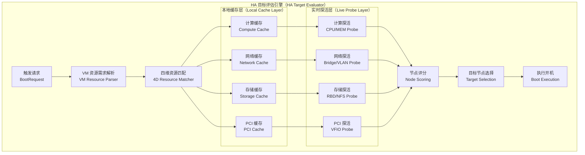

四维资源评估模型的设计逻辑是：缓存层提供"最后已知状态"作为评估基线，实时探活层在开机前的最后一刻对关键资源进行轻量确认，二者结合形成一个"缓存驱动、探活校验"的双保险机制。

#### 1.2.1 计算资源维度

计算资源评估的核心是判断候选节点是否有足够的 CPU 和内存来承载被保护 VM，并且在少数派场景下还需要考虑"过载保护"——因为存活节点需要同时承载自身原有负载和接管的 HA VM。

```text
计算资源评估流程：

1. 从本地缓存读取候选节点的资源基线：
   node_compute_baseline = {
     total_cpu_cores: 48,
     total_memory_mb: 131072,
     numa_topology: [...],
     hugepages_1g: 16,
     hugepages_2m: 0
   }

2. 实时探活当前已使用资源（调用本地 /proc/meminfo + qm list）：
   node_compute_used = {
     used_cpu_cores: 24,   // 当前运行 VM 占用
     used_memory_mb: 65536,
     used_hugepages_1g: 8
   }

3. 计算可用资源：
   available = baseline - used

4. 与 VM 需求进行匹配：
   vm_require = {
     cores: 8,
     memory_mb: 16384,
     hugepages_1g: 0,
     cpu_type: "host",   // 需要验证节点 CPU 指令集兼容性
     numa_affinity: null  // null 表示无 NUMA 亲和性要求
   }

5. 兼容性检查（非仅数量检查）：
   - CPU 类型兼容性：vm.cpu_type="host" 要求源节点与目标节点同一 CPU 架构
   - CPU 特性集：目标节点必须支持 VM 要求的所有 CPU flags（如 avx512, rdma）
   - NUMA 拓扑：若 VM 有 NUMA 亲和性配置，需验证目标节点拓扑满足要求
   - 内存超售比：在少数派模式下，内存超售比上限从正常的 1.5x 降低到 1.0x
     （禁止超售，优先保证业务连续性而非资源利用率）
```

CPU 指令集兼容性是一个常被忽视的硬性约束。在混合架构集群中（如同时存在 Intel Skylake 和 Cascade Lake 节点），配置了 cpu_type=host 的 VM 在迁移到指令集较旧的节点时会因缺少特定 CPU 特性而无法启动。hci-vcls 的计算缓存中必须存储每个节点的 CPU 特性集快照，并在匹配阶段进行严格的特性集检查 [1]。

#### 1.2.2 网络资源维度

网络资源是少数派场景中最容易被低估复杂性的维度。一个 VM 能否在目标节点正常开机，不仅取决于目标节点是否存在对应的网桥，还取决于 VLAN 配置是否一致、上行带宽是否足够、以及在网元重建场景下虚拟网络功能是否就绪。

```text
网络资源评估的四个层次：

层次 1：物理网桥存在性检查
  检查项：目标节点是否存在 VM 所需的网桥（如 vmbr0、vmbr1）
  检查方式：读取本地缓存的网桥配置，实时通过 ip link show 确认网桥存在
  失败处理：若网桥不存在，该节点直接排除（硬性约束）

层次 2：VLAN 配置一致性检查
  检查项：目标节点的网桥是否配置了 VM 所需的 VLAN tag
  检查方式：读取缓存的 VLAN 配置，与实时 bridge vlan show 输出对比
  失败处理：若 VLAN 未配置，触发网络资源重建流程（见第 2 章）

层次 3：上行带宽可用性检查
  检查项：目标节点当前网络带宽利用率是否超过阈值（默认 80%）
  检查方式：读取 /proc/net/dev 中对应接口的流量计数器，计算当前利用率
  失败处理：带宽不足的节点降低评分，但不直接排除（软性约束）

层次 4：网元服务可用性检查（针对 SDN/OVS 场景）
  检查项：若 VM 依赖的网络功能（如虚拟路由器、防火墙）仍在故障节点上运行，
           目标节点即使通过前三层检查，VM 开机后网络也不通
  检查方式：查询本地 SDN 拓扑缓存，识别 VM 的网络依赖链
  失败处理：触发网元异步重建任务（见第 2 章），开机决策延迟到重建完成后
```

#### 1.2.3 存储资源维度

存储可达性是 HA 开机的前提条件，也是最能快速筛除不合格目标节点的维度。

**因为少数派HA和主打场景在存算分离架构偏多，这里以几个典型的存储系统作为外置存储的协议假设来阐述问题。例如Ceph RBD/NFS 、NFS 、iSCSI。**  

```text
存储资源评估矩阵：

存储类型         检查方式                     失败语义
-----------------------------------------------------------------
本地存储 dir     os.Stat 文件路径              VM 磁盘仅在原节点，无法 HA
本地存储 lvm     lvdisplay LV 路径             同上
本地存储 zfs     zfs list dataset             同上
Ceph RBD        rbd status image_path         Ceph 集群故障则全节点不可达
NFS             mount 检查 + statfs           挂载点不可用则节点排除
iSCSI           /dev/disk/by-id 检查          设备未发现则节点排除
Ceph NFS        与 Ceph 相同                   Ceph 集群故障则全节点不可达

关键设计决策：
  本地存储的 VM 在原节点故障后，HA 本质上无法通过存储迁移实现，
  除非存储后端支持跨节点访问（如 Ceph、NFS）。
  hci-vcls 在缓存中记录每个 VM 的存储类型，在 HA 评估阶段直接排除
  "磁盘仅在故障节点"的 VM，并向运维人员发出"无法 HA，需人工介入"告警。
  这是一个正确的失败快速（Fail Fast）设计，避免在注定无法成功的场景上浪费资源。
```

#### 1.2.4 PCI 外设资源维度

PCI 直通（PCIe Passthrough）和 SR-IOV 是企业级 HCI 场景中越来越常见的配置，也是 HA 调度中最难处理的约束。原因在于 PCI 设备的物理位置是固定的，与节点强绑定，无法通过软件层面随意"迁移"。

```text
PCI 外设资源评估策略：

类型 1：PCI 直通（VFIO Passthrough）
  特征：特定 PCI 设备（如 GPU、FPGA、专用网卡）绑定到特定节点
  HA 策略：
    - 若目标节点有相同 PCI ID 的同类设备，且设备当前未被其他 VM 占用，
      则可以 HA 开机（PCI 地址可能不同，但设备功能等价）
    - 若无等价设备，则标记为"降级 HA"：
      去掉 VM 配置中的 PCI 直通配置，以纯软件模拟模式开机，
      业务功能可能受损，但比完全不开机更优
    - 若 VM 的 PCI 设备是业务关键（如硬件加密卡），
      则拒绝降级 HA，向运维人员告警，等待人工决策

类型 2：SR-IOV 虚拟功能（VF）
  特征：物理网卡/GPU 通过 SR-IOV 向多个 VM 提供独立虚拟功能
  HA 策略：
    - 检查目标节点是否有相同 PF（Physical Function）设备
    - 检查目标节点的 VF 数量是否有空余
    - 若满足，重新分配一个 VF 给 HA VM
    - 若目标节点无相同 PF 设备，降级为 virtio 软件网卡

类型 3：USB 直通
  特征：通常为非关键外设（键盘、加密狗等）
  HA 策略：默认去掉 USB 直通配置，以不影响 HA 开机为优先

PCI 缓存结构：
  {cache_dir}/pci/
    {nodeID}/
      pci_devices.json   ← 节点所有 PCI 设备列表（含 PCI ID、IOMMU 组、绑定状态）
      sriov_vfs.json     ← SR-IOV VF 分配状态快照
    {vmID}/
      pci_config.json    ← VM 的 PCI 直通配置快照

pci_devices.json 结构：
  {
    "node_id": "node-01",
    "devices": [
      {
        "pci_addr": "0000:03:00.0",
        "vendor_id": "10de",
        "device_id": "1eb8",
        "class": "0302",
        "description": "NVIDIA Tesla T4",
        "iommu_group": 12,
        "driver": "vfio-pci",
        "in_use_by_vm": 105,
        "sriov_capable": false,
        "sriov_num_vfs": 0
      }
    ],
    "cached_at": "2024-01-15T10:30:00Z"
  }
```

### 1.3 降级调度器设计：复用 HCI Scheduler 的正确姿势

这是整个少数派调度问题中最关键的工程决策点。现有 HCI 调度器是为"全知正常态"设计的，在少数派场景下直接复用会面临三个核心障碍：

第一，调度器依赖 ZK 写锁完成调度决策的原子提交，少数派下写锁不可用。

第二，调度器依赖 CFS 读取全集群资源视图，CFS 只读时视图不可获取。

第三，调度器的调度策略（如负载均衡、反亲和性）在存活节点数量大幅减少时可能陷入无解状态，导致死锁而非降级执行。

hci-vcls 的解决方案是构建一个"调度适配层"（Scheduler Adapter），而非替换调度器。这个适配层扮演的角色类似于一个"代理与降级开关"：在正常模式下，所有调度请求透传给原有 HCI Scheduler；在少数派模式下，适配层切换到本地资源视图驱动的简化调度逻辑，并向上层提供与原调度器相同的接口契约。

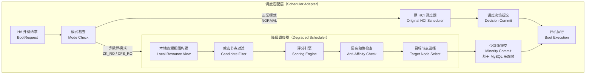

降级调度器的核心设计原则是"充分条件优先于最优条件"：不追求负载最均衡的节点，而是追求第一个能够满足 VM 所有硬性约束（存储可达、网络可达、PCI 设备存在、计算资源足够）的节点。这样设计的原因是：

少数派场景通常是紧急情况，调度决策的速度本身就是业务连续性的一部分。一个花费 30 秒找到最优节点的调度器，不如一个花费 3 秒找到足够好节点的调度器。

```text
降级调度器节点评分规则（权重设计）：

维度                    权重    评分逻辑
--------------------------------------------------------------
存储可达性              40%    全部磁盘可达 = 100分；任意磁盘不可达 = 0分（硬性淘汰）
计算资源充足性          25%    可用资源 / VM 需求 的比值，上限 2.0x，线性映射到 0-100
网络资源完整性          20%    所需网桥/VLAN 全部存在 = 100分；需要重建 = 50分；不可达 = 0分
PCI 设备匹配度          10%    完全匹配 = 100分；等价替代 = 70分；降级软件模拟 = 30分；无法满足 = 0分
节点稳定性历史          5%     基于过去 1 小时心跳稳定性，抖动少的节点得分高

最终得分 = 各维度得分 * 权重 之和
最低可用阈值：存储维度必须为 100 分（硬性约束），其余维度总分不低于 60 分
```

### 1.4 调度决策的完整时序

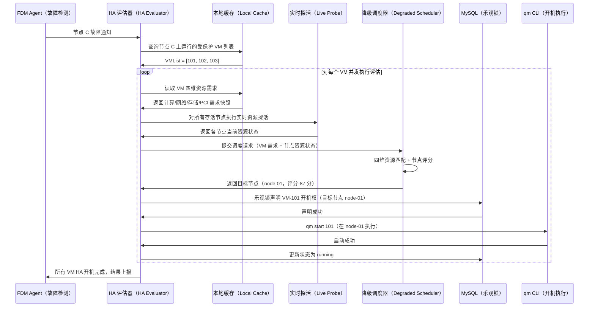

### 1.5 反亲和性与亲和性规则在少数派下的处理

这是一个容易被忽视但在生产环境中极其重要的问题。许多企业 VM 配置了反亲和性规则（如主备数据库不能在同一节点），在正常调度下这些规则由 HCI Scheduler 严格执行。进入少数派模式后，存活节点数量可能大幅减少，反亲和性规则很可能无法满足。

hci-vcls 的处理策略是引入"规则降级等级"的概念：

```text
亲和性规则在少数派模式下的降级处理：

规则类型          正常模式处理      少数派模式处理
---------------------------------------------------------------
硬反亲和性        严格执行          降级为软反亲和性：
（must not）                        优先选择不同节点，若无可用节点则
                                    允许同节点，但生成告警事件，
                                    要求运维人员在集群恢复后手动迁移

软反亲和性        尽量不同节点      直接放宽，不作为评分维度
（prefer not）

硬亲和性          严格执行          维持严格执行：
（must on）                         若目标节点不可用，则 VM 无法 HA，
                                    告警并等待人工决策
                                    （硬亲和性通常对应特殊硬件依赖，
                                    放宽语义可能导致业务功能丧失）

软亲和性          尽量同节点        直接放宽，不作为评分维度
（prefer on）

资源池亲和性      必须在池内节点    若池内全部节点故障，放宽到全集群范围，
（resource pool） 上运行            同时生成资源池逃逸告警
```

---

## 2. 网元资源重建与业务连续性保障

### 2.1 网元重建问题的本质

网元重建问题是少数派场景中最具挑战性的工程难题，原因在于它打破了 HA 的基本假设：传统 HA 假设"网络基础设施是稳定的，只有 VM 需要恢复"。但在过半数节点不可用的极端场景下，支撑 VM 运行的网络功能本身（虚拟路由器、DHCP 服务器、防火墙、SDN 控制器）可能也随着节点故障而消失，此时即使 VM 成功开机，业务流量也无法正常转发。

用一个形象的比喻：传统 HA 解决的是"把人从倒塌的房子里救出来，送到另一栋楼"；而网元重建解决的是"另一栋楼的电梯、水电、门禁系统也坏了，需要在送人进去之前先把这些基础设施修好"。

例如：PVE SDN 支持 VXLAN、EVPN、Simple 等多种网络类型，其中 EVPN 依赖 FRRouting 进程提供 BGP 路由，VXLAN 依赖特定节点上的 VTEP（VXLAN Tunnel Endpoint）配置。当承载这些网元功能的节点故障后，网络功能需要在存活节点上重建 [2]。

### 2.2 需要重建的网元资源分类

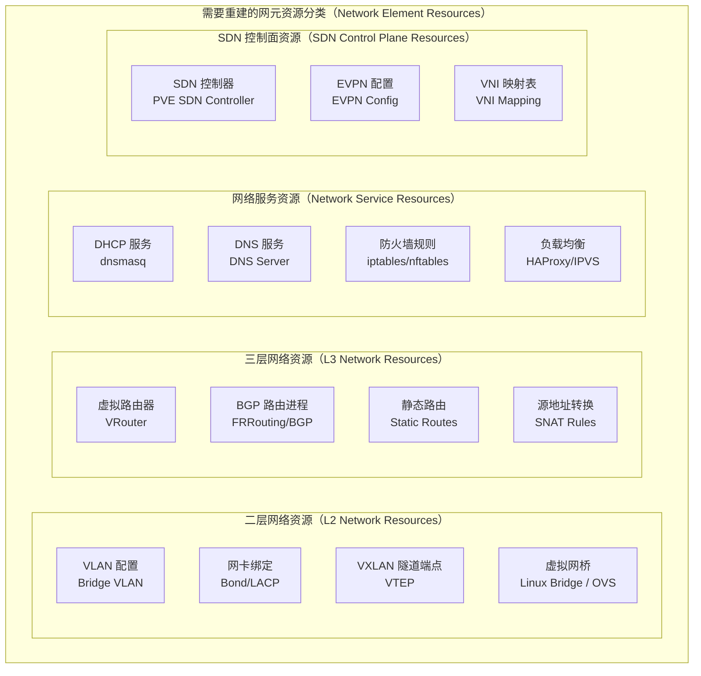

### 2.3 网元重建的异步任务框架

网元重建不能是同步阻塞的。原因是：某些网元重建（如 BGP 路由收敛）需要数十秒到数分钟，如果 HA 开机流程等待网元重建完成再执行，RTO 将大幅增加。正确的设计是将网元重建与 VM 开机解耦，通过异步任务框架并行推进，并在关键依赖点设置等待栅栏（Wait Barrier）。

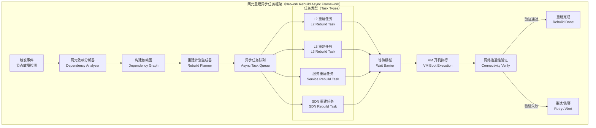

等待栅栏的设计是关键：并非所有 VM 都需要等待所有网元重建完成。栅栏的粒度是"VM 级别"，即每个 VM 只等待其自身所依赖的网元重建完成，而不是等待集群所有网元全部重建完成。这样可以最大化并发度，让不依赖故障网元的 VM 尽快开机。

### 2.4 网元依赖分析器设计

网元依赖分析器是整个重建框架的核心。它需要在缓存中维护一张"VM 到网元的依赖映射表"，并在节点故障后快速计算出哪些网元需要重建、重建的优先级顺序、以及重建应在哪个存活节点上执行。

```text
VM 到网元依赖映射表结构（存储于本地缓存）：

文件路径：{cache_dir}/network/dependency_graph.json

{
  "vms": {
    "101": {
      "network_deps": {
        "bridges": ["vmbr0", "vmbr1"],
        "vlans": [{"bridge": "vmbr0", "tag": 100}, {"bridge": "vmbr1", "tag": 200}],
        "vxlan_vnis": [10100],
        "virtual_router": "vr-prod-01",
        "dhcp_zone": "zone-prod",
        "firewall_ipset": ["prod-servers", "monitoring"],
        "sdn_zone": "prod-zone"
      }
    },
    "102": {
      "network_deps": {
        "bridges": ["vmbr0"],
        "vlans": [{"bridge": "vmbr0", "tag": 100}],
        "vxlan_vnis": [10100],
        "virtual_router": "vr-prod-01",
        "dhcp_zone": "zone-prod",
        "firewall_ipset": ["prod-servers"],
        "sdn_zone": "prod-zone"
      }
    }
  },
  "network_elements": {
    "vr-prod-01": {
      "type": "virtual_router",
      "primary_node": "node-03",
      "config_snapshot": { ... },
      "depends_on": ["zone-prod", "vmbr0"]
    },
    "zone-prod": {
      "type": "sdn_zone",
      "zone_type": "evpn",
      "config_snapshot": { ... },
      "frr_config": "...",
      "depends_on": []
    }
  }
}
```

依赖分析器在节点故障后执行以下步骤：

第一步，识别故障节点上运行的所有网元（通过缓存的网元-节点映射表）。

第二步，对每个故障网元，查找依赖它的所有 VM。

第三步，对每个需要重建的网元，在存活节点中选择重建目标节点（选择逻辑与 VM 调度类似，但考虑网元的特殊亲和性约束，如 DHCP 服务器应尽量分散在不同节点上）。

第四步，按照网元间的依赖关系进行拓扑排序，生成有序的重建计划（如 SDN Zone 必须在虚拟路由器之前重建，DHCP 服务必须在虚拟路由器之后重建）。

第五步，将重建计划提交到异步任务队列，并为每个受影响的 VM 注册相应的等待栅栏。

### 2.5 各类网元的重建实现

#### 2.5.1 L2 网络重建（VLAN/VXLAN）

```text
VLAN 配置重建流程：

前提：目标节点已存在对应网桥（vmbr0）

重建步骤：
1. 从缓存读取 VLAN 配置快照
2. 检查目标节点当前 VLAN 配置（bridge vlan show dev vmbr0）
3. 计算差异（缓存配置 - 当前配置）
4. 对每个缺失的 VLAN tag 执行：
   bridge vlan add dev vmbr0 vid {tag} master
5. 验证：bridge vlan show dev vmbr0 | grep {tag}
6. 更新缓存中的 VLAN 配置状态

VXLAN VTEP 重建流程：

前提：目标节点内核支持 VXLAN，且物理网络支持 UDP 4789 端口

重建步骤：
1. 从缓存读取 VXLAN 配置快照（VNI、本端 IP、对端 IP 列表）
2. 创建 VXLAN 接口：
   ip link add vxlan{VNI} type vxlan id {VNI}
     local {local_ip} dstport 4789 nolearning
3. 将 VXLAN 接口加入对应网桥：
   ip link set vxlan{VNI} master vmbr{X}
4. 配置 FDB（转发数据库）条目：
   bridge fdb append 00:00:00:00:00:00 dev vxlan{VNI} dst {peer_ip}
   （对每个对端节点 IP 执行）
5. 激活接口：ip link set vxlan{VNI} up
6. 验证：ping 测试跨节点 VXLAN 连通性

预期重建时间：< 5 秒（纯本地操作，无需远程协调）
```

#### 2.5.2 L3 网络重建（虚拟路由器/BGP）

BGP 路由重建是所有网元重建中耗时最长、最复杂的部分，因为它涉及 FRRouting 进程的启动、BGP 会话的建立和路由收敛。

```text
BGP/EVPN 重建流程：

1. 从缓存读取 FRR 配置快照（frr.conf + bgpd.conf）
2. 在目标节点检查 FRR 是否已安装（which vtysh）
3. 将缓存的 FRR 配置写入目标节点 /etc/frr/frr.conf
4. 启动 FRR 服务：systemctl start frr
5. 等待 BGP 会话建立（轮询 vtysh -c "show bgp summary"，
   检查 Up/Down 状态，超时 60 秒）
6. 验证 EVPN 路由是否已收敛（vtysh -c "show bgp l2vpn evpn"）
7. 验证目标 VNI 的 MAC/IP 路由是否已学习

预期重建时间：30-90 秒（BGP 收敛时间依赖网络环境）

关键设计决策：
  FRR 配置快照必须包含完整的 BGP 配置，包括：
  - AS 号、Router ID
  - BGP 邻居列表（存活节点的 BGP 地址）
  - EVPN 地址族配置
  - VNI 到 VRF 的映射关系
  
  注意：故障节点的 BGP 邻居地址需要从重建配置中移除，
  否则 FRR 会持续尝试连接故障节点，产生无效的 BGP 连接告警。
  依赖分析器在生成重建计划时负责动态过滤故障节点的邻居地址。
```

#### 2.5.3 DHCP 服务重建

```text
DHCP 服务（dnsmasq）重建流程：

1. 从缓存读取 DHCP 配置快照：
   {cache_dir}/network/dhcp/
     {zone}/
       dnsmasq.conf      ← dnsmasq 主配置
       hosts.conf        ← 静态 MAC-IP 绑定记录
       leases.db         ← 租约数据库快照

2. 在目标节点创建配置目录并写入配置文件
3. 写入静态 MAC-IP 绑定记录（hosts.conf），确保 VM 重新开机后
   获取与故障前相同的 IP 地址，避免 IP 漂移导致业务中断

4. 导入租约数据库快照（leases.db）：
   cp {cache_dir}/network/dhcp/{zone}/leases.db /var/lib/misc/dnsmasq.leases
   重要：租约数据库必须从缓存恢复，否则 dnsmasq 在重建后会
   将已分配的 IP 视为空闲，可能导致 IP 冲突

5. 启动 dnsmasq：
   dnsmasq --conf-file=/etc/pve/sdn/dnsmasq/{zone}/dnsmasq.conf \
           --pid-file=/run/dnsmasq-{zone}.pid

6. 验证：
   - 检查 dnsmasq 进程存活
   - 发送 DHCP DISCOVER 测试包，验证响应正常
   - 检查静态绑定记录是否生效

预期重建时间：< 3 秒

关键设计决策：
  静态 MAC-IP 绑定是 DHCP 重建的核心价值所在。
  在企业 HCI 环境中，VM 的 IP 地址通常与 DNS 记录、
  防火墙策略、监控系统深度绑定，IP 地址漂移带来的
  次生故障往往比 VM 短暂下线更难处理。
  hci-vcls 的 DHCP 缓存必须以 MAC-IP 静态绑定为核心，
  而非仅存储动态租约记录。
```

#### 2.5.4 防火墙规则重建

```text
防火墙规则（iptables/nftables）重建流程：

缓存内容：
  {cache_dir}/network/firewall/
    cluster/
      cluster_rules.nft   ← 集群级别防火墙规则
    {vmID}/
      vm_rules.nft        ← VM 级别防火墙规则
      ipsets.nft          ← VM 依赖的 IP 集合定义

重建步骤：
1. 从缓存读取 VM 防火墙规则快照
2. 检查目标节点当前 nftables 规则（nft list ruleset）
3. 计算差异（缺失的规则集合）
4. 加载 IP 集合定义：nft -f {ipsets.nft}
5. 加载 VM 防火墙规则：nft -f {vm_rules.nft}
6. 验证规则加载成功：nft list table bridge filter

注意事项：
  - 防火墙规则中可能包含对其他 VM IP 的引用（如允许特定源 IP 访问）
  - 若引用的源 IP 对应的 VM 也在 HA 恢复过程中，IP 地址应保持不变
    （依赖 DHCP 静态绑定保障），因此防火墙规则无需动态修改
  - 若 VM 使用了 IPSet（IP 集合），IPSet 必须在 VM 防火墙规则之前加载
  - nftables 的原子性加载（nft -f）保证规则要么全部生效要么全部失败，
    避免部分规则生效导致的安全漏洞

预期重建时间：< 2 秒
```

### 2.6 网元重建与 VM 开机的协同时序

下图展示了在过半数节点不可用的极端场景下，网元重建与 VM HA 开机如何并行推进，以及等待栅栏如何精确控制两条流水线的同步点。

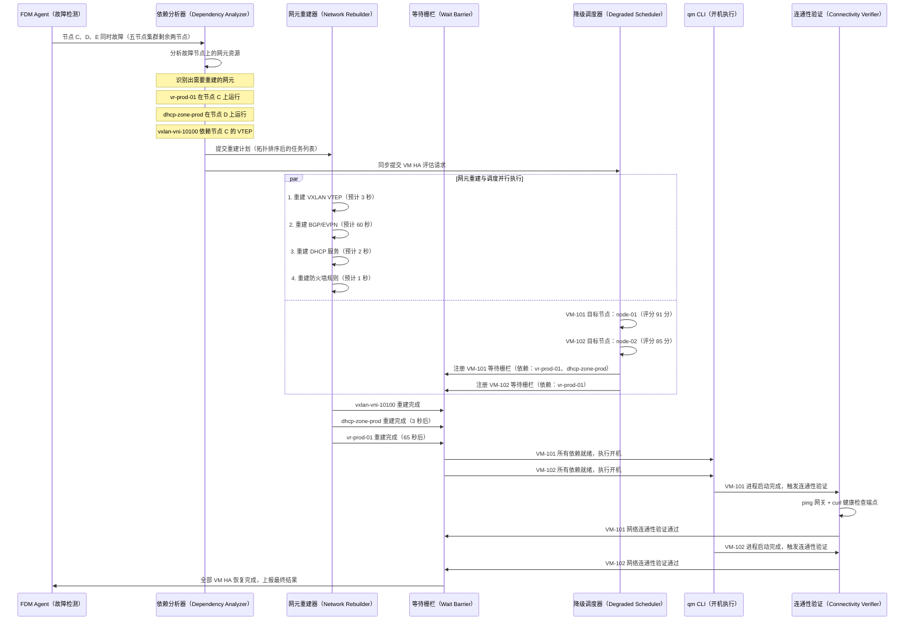

这个时序图揭示了一个关键的设计取舍：VM-101 和 VM-102 都必须等待 BGP/EVPN 收敛（约 60 秒）才能开机。这是无法避免的硬性依赖——在虚拟路由器未就绪之前开机，VM 的三层流量无法转发，开机等于无效。因此 hci-vcls 选择等待网元重建完成，而不是"让 VM 先开机，网络后续再恢复"——后者会导致应用层在网络不通的情况下执行错误的故障恢复逻辑（如触发主备切换），反而造成更大的业务混乱。

### 2.7 网元重建的失败处理与人工介入

并非所有网元重建都能自动成功。hci-vcls 定义了三级失败处理策略：

```text
网元重建失败处理三级策略：

级别 1：自动重试（Auto Retry）
  适用场景：瞬时失败（如 systemctl start frr 因资源未就绪失败）
  重试策略：指数退避，初始间隔 5 秒，最大间隔 60 秒，最大重试 5 次
  超时设置：单次重建任务总超时 5 分钟

级别 2：降级执行（Degraded Execution）
  适用场景：网元重建成功但功能不完整
  示例：BGP 进程已启动但路由收敛不完整，部分路由可达
  处理：标记网元为"降级可用"状态，允许依赖此网元的 VM 开机，
        同时持续在后台推进完整收敛，并向运维人员发送降级告警

级别 3：人工介入（Manual Intervention）
  适用场景：自动重建失败且无法降级执行
  示例：DHCP 服务器配置文件损坏（缓存校验失败），
        无法安全自动重建
  处理：
    a. 将受影响 VM 标记为"等待网元重建"状态，暂停开机
    b. 向运维平台发送高优先级告警，包含：
       - 故障网元名称和类型
       - 失败原因和错误日志
       - 建议的人工介入步骤
       - 受影响的 VM 列表和预估业务影响
    c. 提供 CLI 接口允许运维人员手动触发重建或跳过此网元强制开机：
       hci-vcls rebuild network --element vr-prod-01 --force
       hci-vcls ha boot --vm 101 --skip-network-check
```

---

## 3. 本地缓存机制与 vCenter + vCLS 等效性论证

### 3.1 问题的哲学本质

"本地缓存能否达到 vCenter + vCLS 的效果"这个问题，其实是在问：**一个去中心化的、基于预先快照的信息系统，能否在功能等效性上媲美一个中心化的、基于实时状态的权威系统？**

要回答这个问题，必须先精确定义 vCenter + vCLS 在 HA 场景下的核心职责，然后逐项对照 hci-vcls 的本地缓存机制能否覆盖。

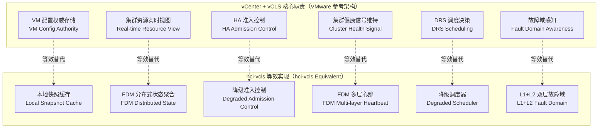

### 3.2 逐项等效性论证

#### 3.2.1 VM 配置权威存储的等效性

vCenter 在正常模式下是 VM 配置的绝对权威，所有 VM 的 CPU、内存、磁盘、网络配置均以 vCenter 数据库为准。vCLS VM 作为 vCenter 的代理，确保即使 vCenter 短暂离线，ESXi 主机仍能从 vCLS VM 获取必要的集群配置信息。

hci-vcls 的本地缓存机制在这一维度上的等效性论证如下：

vCenter 的权威性来源于两点：其一，配置数据存储在高可用数据库中，不会因单节点故障而丢失；其二，所有配置变更必须经过 vCenter 才能生效，保证了配置的唯一性。

hci-vcls 通过以下三个机制实现等效：

```text
机制一：多节点缓存冗余（对应 vCenter 数据库高可用）

每个节点独立维护一份完整的 VM 配置缓存。
在 N 节点集群中，同一份 VM 配置存在 N 个副本。
只要有一个节点存活，配置信息就不会丢失。

与 vCenter 的关键差异：
  vCenter 是"单一权威写入，多节点读取"
  hci-vcls 是"多节点独立写入，本地读取"

这一差异带来的一致性问题：
  若 VM 配置在 CFS 中发生了变更，但缓存同步周期尚未到来
  （默认 60 秒），则本地缓存中存储的是旧版本配置。

一致性保障策略（三层）：
  层 1：版本号校验
    每个缓存条目携带 source_version（对应 CFS 配置文件的 mtime 时间戳）。
    HA 执行引擎在使用缓存前检查版本号，若版本号落后超过阈值（默认 2 个版本），
    发出警告日志，但仍允许使用（因为在降级场景下，旧版本配置优于无配置）。

  层 2：事件驱动同步
    除周期同步外，hci-vcls 通过 inotify 监听 CFS 配置目录：
    inotify_add_watch("/etc/pve/nodes/{nodeID}/qemu-server/", IN_MODIFY | IN_CREATE)
    当 VM 配置文件发生变更时，立即触发增量同步，而非等待下一个周期。
    在正常模式下，配置变更后缓存更新的延迟通常低于 2 秒。

  层 3：关键变更双写
    对于影响 HA 语义的关键配置变更（如 HA 开关切换、内存大小调整），
    CFS 写入成功后，同步将变更写入 MySQL 配置镜像表。
    MySQL 作为缓存同步的辅助数据源，在 CFS 不可达时提供次新配置。
```

```text
机制二：写入拦截与缓存失效（对应 vCenter 配置变更强制经过权威节点）

hci-vcls 在 PVE API 层注入配置变更拦截钩子（Hook）：
  - VM 创建 → 触发全量缓存写入
  - VM 配置修改 → 触发增量缓存更新
  - VM 删除 → 触发缓存条目删除
  - HA 组配置修改 → 触发所有相关 VM 缓存更新

这一机制确保缓存与 CFS 的状态尽可能接近，
缩短了"配置变更到缓存生效"的时间窗口。

局限性（诚实承认，而非刻意回避）：
  若节点在缓存同步窗口期内（变更后、inotify 触发前）发生故障，
  缓存中仍是旧版本配置。这一时间窗口通常在 2 秒以内。
  在极端情况下（inotify 事件丢失、磁盘 IO 繁忙），窗口可能延长到 60 秒。
  hci-vcls 接受这一最坏情况下的 60 秒配置陈旧风险，原因是：
  在生产环境中，VM 配置变更（尤其是 HA 相关配置变更）的频率极低，
  几乎不存在"刚刚修改了 HA 配置、2 秒内节点就故障"的真实场景。
```

```text
机制三：缓存完整性校验（对应 vCenter 数据库事务一致性）

每个缓存文件在写入时计算 SHA-256 校验和，并存储在 manifest.json 中。
缓存读取时验证校验和，若不匹配则触发强制重新同步。
写入操作使用原子替换（write to temp file + rename）保证写入的原子性。

manifest.json 结构：
{
  "total_entries": 15,
  "last_sync_at": "2024-01-15T10:30:00Z",
  "last_sync_source": "cfs",
  "entries": {
    "101": {
      "sha256": "a3f2c1d...",
      "source_version": 1705312200,
      "cached_at": "2024-01-15T10:30:00Z",
      "size_bytes": 2048
    }
  }
}
```

#### 3.2.2 集群资源实时视图的等效性

vCenter 通过持续轮询 ESXi 主机获取实时资源使用情况，并在内存中维护一张全集群的资源快照，供 DRS 和 HA 决策使用。这是 vCenter 最重要的功能之一，也是最难以在无中心节点的情况下复现的能力。

```text
vCenter 实时资源视图 vs hci-vcls 近实时资源视图对比：

维度              vCenter 实现          hci-vcls 实现         等效度
-------------------------------------------------------------------
数据新鲜度        实时（秒级）           近实时（30 秒以内）    ★★★★☆
数据完整性        全集群视图             存活节点本地视图       ★★★☆☆
数据权威性        单一权威中心           分布式共识             ★★★★☆
故障下可用性      vCenter 离线则不可用   去中心化，任意节点可用  ★★★★★
扩展性            受 vCenter 性能限制    水平扩展               ★★★★★

综合等效度评估：在正常模式下，hci-vcls 的资源视图约等于
vCenter 实时视图的 80%（牺牲了部分新鲜度和完整性）。
在降级模式下，hci-vcls 的可用性远高于 vCenter（后者在 vCenter 
离线时完全不可用，而前者仍能基于本地缓存提供有限决策能力）。
```

hci-vcls 通过 FDM Agent 的分布式状态聚合实现近实时资源视图：

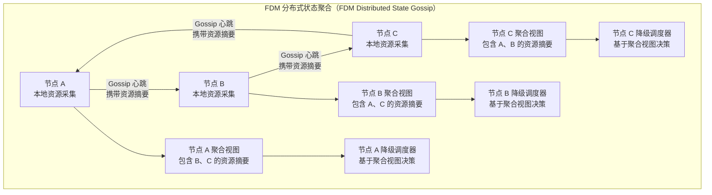

每个 FDM Agent 的 Gossip 心跳包中携带本节点的资源摘要，格式如下：

```text
Gossip 心跳包资源摘要字段：

{
  "node_id": "node-01",
  "timestamp": 1705312200,
  "resources": {
    "cpu": {
      "total_cores": 48,
      "used_cores": 12.5,
      "load_avg_1m": 3.2
    },
    "memory": {
      "total_mb": 196608,
      "used_mb": 81920,
      "balloon_mb": 4096
    },
    "storage": {
      "pools": [
        {
          "pool_id": "ceph-hdd",
          "total_gb": 20480,
          "used_gb": 8192,
          "iops_used": 1200,
          "healthy": true
        }
      ]
    },
    "network": {
      "bridges": ["vmbr0", "vmbr1"],
      "active_vlans": [100, 200, 300],
      "uplink_mbps": 10000,
      "used_mbps": 2340
    }
  },
  "running_vms": [101, 103, 107, 112],
  "version": 42
}
```

接收方节点在收到 Gossip 心跳后，将其中的资源摘要合并到本地的集群资源聚合视图中。聚合视图的更新是增量的：每次收到某节点的最新心跳，就用最新数据覆盖该节点的上一条记录。整个聚合视图在内存中维护，不持久化到磁盘（因为资源状态是易变的，持久化的意义不大；而 VM 配置才是需要持久化的关键信息）。

#### 3.2.3 HA 准入控制的等效性

vCenter HA 准入控制（Admission Control）的核心职责是：在允许 HA 开机之前，确认集群有足够的资源来承载被保护 VM，从而防止资源过量承诺导致的雪崩故障 [3]。

```text
vCenter HA 准入控制策略 vs hci-vcls 降级准入控制：

vCenter 支持三种准入控制策略：
  策略 1：为故障转移保留特定主机数量
  策略 2：为故障转移保留特定百分比的集群资源
  策略 3：指定故障转移主机

hci-vcls 在降级模式下实现等效的准入控制：

  准入检查项 1：目标节点计算资源充足性检查
    可用 CPU ≥ VM vCPU 数 × 1.2（20% 超配保护系数）
    可用内存 ≥ VM 内存配置 × 1.1（10% 超配保护系数）
    若不满足，拒绝在此节点开机，尝试下一候选节点

  准入检查项 2：存活节点总资源充足性检查
    所有存活节点的可用资源总和 ≥ 所有待 HA VM 资源需求总和 × 1.1
    若不满足，触发"资源超量承诺告警"，但仍允许开机
    （在少数派极端场景下，宁愿过载也要保证业务连续性，
    过载告警由运维人员决策是否中止部分 VM）

  准入检查项 3：存储资源可达性检查
    目标节点必须能够访问 VM 所在的存储池（Ceph RBD / NFS / Local）
    检查方法：rbd status {pool}/{vm-disk-image} --cluster ceph
    若存储不可达，拒绝开机并标记为"存储不可达，等待恢复"

  准入检查项 4：网元依赖就绪性检查
    VM 依赖的所有网元（虚拟路由器、DHCP、VXLAN VTEP）必须处于
    "已就绪"或"降级可用"状态（详见第 2 节网元重建框架）
    若网元处于"重建中"状态，VM 进入等待栅栏，不拒绝开机，只延迟执行

  准入检查项 5：PCI 设备可用性检查
    若 VM 配置了 PCI 直通，检查目标节点是否有等价 PCI 设备可用
    若无等价设备，根据 PCI 设备的 ha_critical 标记决策：
      ha_critical=true → 拒绝开机，告警等待人工决策
      ha_critical=false → 降级开机（去掉 PCI 直通配置，以软件模拟替代）

准入控制决策结果枚举：
  ADMIT          → 允许开机，资源充足
  ADMIT_DEGRADED → 允许降级开机（部分资源降级，如 PCI 设备降级为软件模拟）
  DEFER          → 延迟开机（等待网元重建完成）
  REJECT_NODE    → 拒绝在此节点开机，尝试下一候选节点
  REJECT_ALL     → 拒绝所有候选节点，告警等待人工决策
```

#### 3.2.4 集群健康信号维持的等效性

vCLS（vSphere Cluster Services）的核心设计思想是：将集群健康信号的维持从 vCenter 进程中解耦出来，通过在每个数据存储上运行的代理 VM 提供独立的健康心跳。即使 vCenter 完全离线，vCLS VM 仍然持续运行，ESXi 主机通过与 vCLS VM 通信来判断集群是否健康 [4]。

这是 vCLS 最具创意的设计之一：它将"集群健康"这一概念从"中心节点是否存活"解耦为"分布式心跳是否持续"。

hci-vcls 的 FDM 多层心跳机制在设计哲学上与 vCLS 完全一致：

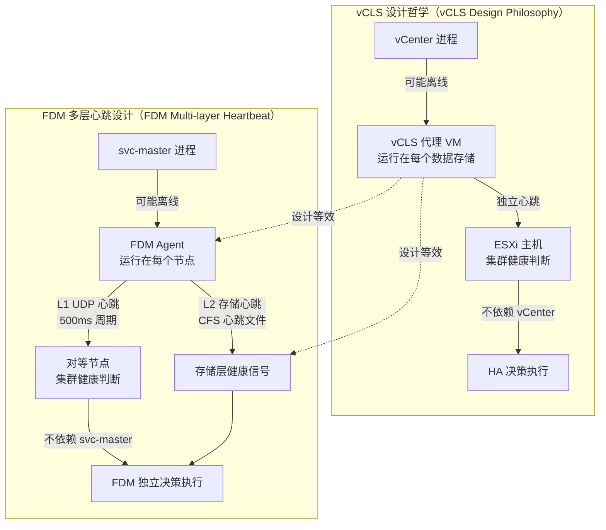

两者的设计等效性体现在以下几个关键点：

**第一，心跳源的独立性。** vCLS VM 独立于 vCenter 进程运行，即使 vCenter 崩溃，vCLS VM 仍然持续发送心跳。FDM Agent 独立于 svc-master 进程运行，即使 svc-master 崩溃，FDM Agent 仍然持续发送 L1/L2 心跳。

**第二，多路径心跳冗余。** vCLS 通过在多个数据存储上运行 VM 提供冗余。FDM 通过 L1（网络路径）和 L2（存储路径）两条独立物理路径提供冗余，任意一条路径存活即可维持健康信号。

**第三，心跳与决策解耦。** vCLS 只维持健康信号，HA 决策仍由 ESXi 主机执行。FDM 的 L1/L2 心跳只负责维持存活探测，HA 执行决策由 FDM Leader 通过独立的决策引擎执行。

```text
vCLS 与 FDM 心跳机制详细对比：

对比维度             vCLS                     FDM Agent
----------------------------------------------------------------
心跳载体             代理 VM 进程             Agent 进程（独立 systemd 服务）
心跳路径数量          1 条（数据存储网络）      2 条（L1 网络 + L2 存储）
心跳周期             约 10 秒                 L1: 500ms / L2: 10 秒
心跳超时判定          3 次心跳丢失             L1: 3 次 + L2: 30 秒
心跳信息携带量        轻量（健康标志）          中量（资源摘要 + 节点状态）
网络分区处理          依赖数据存储仲裁          L1+L2 双路径仲裁
选主机制             vCenter 协调             Raft-lite 独立选主
故障判定权威性        ESXi 本地判定            FDM Leader 集中判定

结论：FDM 的心跳机制在可靠性上不低于 vCLS，
在信息携带量和双路径冗余上甚至优于 vCLS。
```

#### 3.2.5 故障域感知的等效性

vCenter 的故障域感知依赖管理员手动配置主机组、VM 组和亲和性规则，然后 vCenter 在 HA 开机时根据这些规则进行目标节点选择 [5]。

hci-vcls 的故障域感知通过以下机制实现等效：

```text
故障域感知缓存结构：
{cache_dir}/topology/
  fault_domains.json    ← 故障域配置（机架、电源域、网络域）
  affinity_rules.json   ← VM 亲和性/反亲和性规则快照
  node_topology.json    ← 节点物理拓扑（机架位置、电源组）

fault_domains.json 结构：
{
  "fault_domains": [
    {
      "id": "rack-01",
      "type": "rack",
      "nodes": ["node-01", "node-02", "node-03"],
      "power_unit": "pdu-01",
      "network_uplink": "sw-01-port-1"
    },
    {
      "id": "rack-02",
      "type": "rack",
      "nodes": ["node-04", "node-05"],
      "power_unit": "pdu-02",
      "network_uplink": "sw-01-port-2"
    }
  ]
}

affinity_rules.json 结构：
{
  "rules": [
    {
      "id": "rule-web-anti-affinity",
      "type": "anti_affinity",
      "vm_ids": [101, 102, 103],
      "description": "Web 服务器反亲和性规则，不在同一节点运行",
      "ha_enforcement": "soft"
    },
    {
      "id": "rule-db-fault-domain",
      "type": "fault_domain_spread",
      "vm_ids": [201, 202],
      "description": "数据库主备必须分布在不同故障域",
      "ha_enforcement": "hard"
    }
  ]
}

ha_enforcement 枚举含义：
  hard → HA 开机时必须满足此规则，若无法满足则拒绝开机并告警
  soft → HA 开机时尽量满足此规则，若无法满足则降级执行并记录日志
```

降级调度器在目标节点评分阶段会读取故障域和亲和性规则缓存，并将规则约束纳入评分计算：

```text
目标节点评分模型（含故障域约束）：

最终得分 = 基础资源得分 × 故障域奖惩系数 × 亲和性奖惩系数

基础资源得分（0-100）：
  CPU 可用率得分   = (1 - cpu_used/cpu_total) × 30
  内存可用率得分   = (1 - mem_used/mem_total) × 40
  存储可用率得分   = (1 - storage_used/storage_total) × 20
  网络可用率得分   = (1 - net_used/net_total) × 10

故障域奖惩系数（0.5 - 1.5）：
  若目标节点与 VM 原始节点在同一故障域（同一机架）：× 0.8（轻微惩罚）
  若目标节点在不同故障域：× 1.2（奖励，分散故障风险）
  若目标节点是唯一存活节点（无选择余地）：× 1.0（不奖惩）

亲和性奖惩系数（0.0 - 1.5）：
  违反 hard 反亲和性规则：× 0.0（直接淘汰，不得选择此节点）
  违反 soft 反亲和性规则：× 0.5（大幅惩罚，但仍可选择）
  满足 fault_domain_spread 规则：× 1.3（奖励）
  违反 fault_domain_spread hard 规则：× 0.0（直接淘汰）

示例：
  VM-101（Web 服务器，soft 反亲和规则，要求不与 VM-102 同节点）
  候选节点 node-01：
    基础资源得分 = 75
    故障域系数  = 1.2（不同机架）
    亲和性系数  = 0.5（VM-102 已在 node-01 运行，违反 soft 反亲和规则）
    最终得分    = 75 × 1.2 × 0.5 = 45

  候选节点 node-02：
    基础资源得分 = 65
    故障域系数  = 1.2（不同机架）
    亲和性系数  = 1.0（无亲和性约束）
    最终得分    = 65 × 1.2 × 1.0 = 78

  结论：选择 node-02（得分 78 > 45），
  尽管 node-01 基础资源更充足，但亲和性约束使 node-02 成为更优选择。
```

### 3.3 本地缓存与 vCLS 等效性的整体评估

经过以上六个维度的逐项论证，可以给出如下系统性结论：

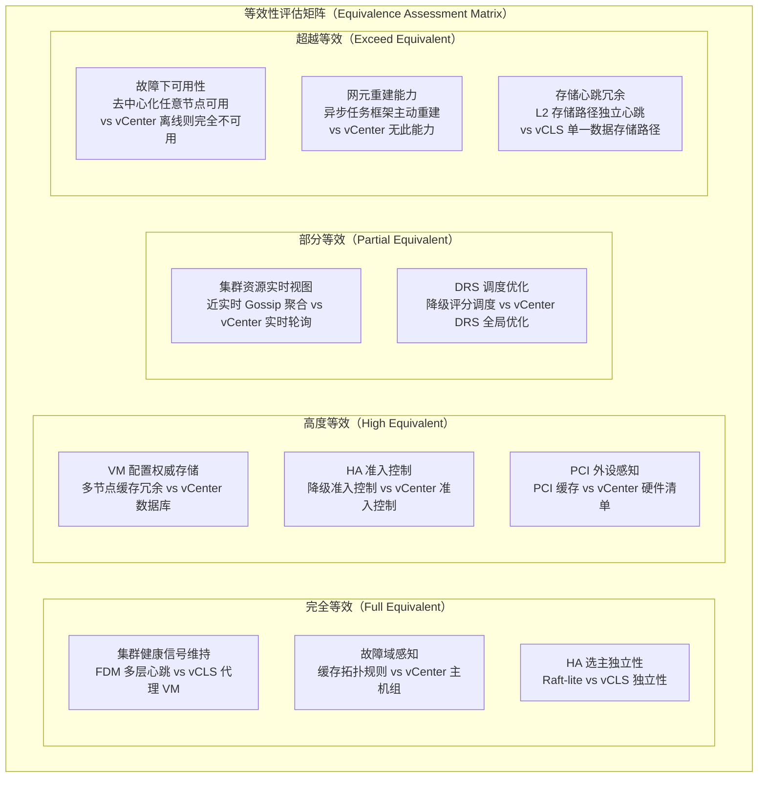

这张等效性评估矩阵揭示了一个重要的洞察：hci-vcls 的本地缓存机制并非在所有维度上都"低于" vCenter + vCLS，而是在不同维度上呈现出不同的取舍。在正常运行时的资源视图实时性上，hci-vcls 略逊于 vCenter（近实时 vs 实时）；但在故障场景下的可用性上，hci-vcls 远超 vCenter（去中心化 vs 中心化单点）；在网元重建能力上，hci-vcls 提供了 vCenter 完全没有的主动重建能力。

### 3.4 等效性的根本论证：CAP 定理视角

用 CAP 定理（一致性、可用性、分区容错性）来审视这个问题，可以得到最本质的洞察 [6]：

```text
CAP 定理视角下的架构对比：

vCenter + vCLS 的 CAP 选择：
  一致性（C）：★★★★★  VM 配置以 vCenter 数据库为唯一权威，强一致
  可用性（A）：★★★☆☆  vCenter 离线或网络分区时，HA 能力部分降级
  分区容错（P）：★★★☆☆  网络分区时依赖 vCLS 提供有限的分区容错

  本质：CP 倾向系统（在一致性与分区容错之间倾向一致性，
        在网络分区时牺牲部分可用性）

hci-vcls 的 CAP 选择：
  一致性（C）：★★★★☆  最终一致（缓存与 CFS 之间存在最大 60 秒的一致性窗口）
  可用性（A）：★★★★★  去中心化设计，任意节点存活即可提供 HA 服务
  分区容错（P）：★★★★★  多层心跳 + 本地缓存 + 降级调度，深度分区容错

  本质：AP 倾向系统（在可用性与分区容错之间倾向可用性，
        在网络分区时接受有限的一致性降级）

关键洞察：
  vCenter + vCLS 和 hci-vcls 是两种不同 CAP 取舍下的合理设计，
  而非简单的优劣对比。

  在"单一权威中心可靠存在"的前提下，vCenter 的 CP 设计提供了
  更强的配置一致性保证，是正确的选择。

  在"中心节点本身可能故障、集群可能过半数节点不可用"的极端场景下，
  hci-vcls 的 AP 设计提供了更强的可用性保证，是正确的选择。

  hci-vcls 并非要"替代" vCenter + vCLS，而是在
  PVE 原生 HA（无 vCenter）的架构约束下，提供最接近 vCLS 语义的
  去中心化等效实现，并在故障可用性维度上实现超越。
```

---

## 4. 三大问题的系统性协同设计

前三节分别论述了少数派调度、网元重建、本地缓存三个核心问题。在真实的灾难场景中，这三个问题是同时发生、相互依赖的。本节通过一个完整的极端场景演练，展示三个子系统如何协同工作。

### 4.1 极端场景定义：五节点集群三节点同时故障

```text
场景定义：
  集群规模：5 节点（node-01 至 node-05）
  存活节点：node-01、node-02（占总数 40%，少数派）
  故障节点：node-03、node-04、node-05
  ZooKeeper 状态：少数派只读（存活节点无法获得写法定人数）
  CFS 状态：只读（依赖 ZK 写法定人数）
  MySQL 状态：可用（独立部署在 node-01 上，随 node-01 存活）

故障节点上运行的资源：
  node-03：VM-101（Web 服务器）、VM-201（数据库主库）、vr-prod-01（虚拟路由器）
  node-04：VM-102（Web 服务器）、VM-202（数据库备库）、dhcp-zone-prod（DHCP 服务）
  node-05：VM-103（API 服务器）、VM-301（监控服务）、vxlan-vtep-05（VTEP 节点）

存活节点资源状态（来自 Gossip 聚合视图）：
  node-01：CPU 可用 36 核，内存可用 120GB，存储 Ceph 可达，网桥 vmbr0/vmbr1 正常
  node-02：CPU 可用 40 核，内存可用 150GB，存储 Ceph 可达，网桥 vmbr0/vmbr1 正常

保护 VM 资源需求：
  VM-101：4 vCPU，8GB，virtio 网卡，HA 优先级 1，网元依赖：vr-prod-01、dhcp-zone-prod
  VM-102：4 vCPU，8GB，virtio 网卡，HA 优先级 1，网元依赖：vr-prod-01
  VM-103：8 vCPU，16GB，virtio 网卡，HA 优先级 2，网元依赖：vr-prod-01、vxlan-vtep
  VM-201：16 vCPU，64GB，virtio 网卡，HA 优先级 1，PCI直通：NVIDIA T4（ha_critical=false）
  VM-202：16 vCPU，64GB，virtio 网卡，HA 优先级 1，网元依赖：vr-prod-01
  VM-301：2 vCPU，4GB，virtio 网卡，HA 优先级 3，无特殊依赖
```

### 4.2 完整协同恢复时序

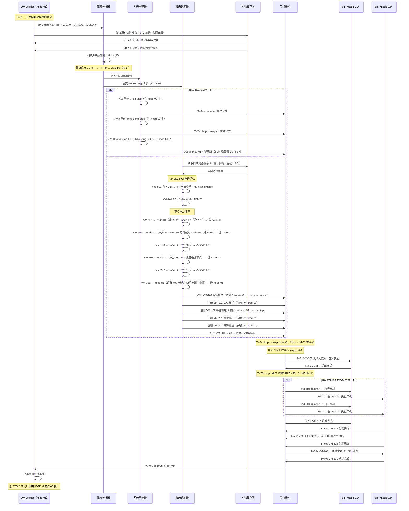

### 4.3 恢复报告结构

完整的协同恢复结束后，FDM Leader 生成结构化恢复报告，供运维人员审阅和后续分析：

```text
恢复报告结构（RecoveryReport）：

{
  "report_id": "recovery-20240115-100000",
  "cluster_id": "hci-prod-cluster-01",
  "trigger_time": "2024-01-15T10:00:00Z",
  "complete_time": "2024-01-15T10:01:19Z",
  "total_rto_seconds": 79,
  "failed_nodes": ["node-03", "node-04", "node-05"],
  "survivor_nodes": ["node-01", "node-02"],
  "cluster_mode": "ZK_RO_CFS_RO",

  "network_rebuild_summary": {
    "total_elements": 3,
    "rebuilt_successfully": 3,
    "rebuild_timeline": [
      {
        "element_id": "vxlan-vtep-05",
        "element_type": "VTEP",
        "original_node": "node-05",
        "rebuilt_on_node": "node-01",
        "start_time": "2024-01-15T10:00:01Z",
        "complete_time": "2024-01-15T10:00:04Z",
        "duration_seconds": 3,
        "status": "SUCCESS"
      },
      {
        "element_id": "dhcp-zone-prod",
        "element_type": "DHCP",
        "original_node": "node-04",
        "rebuilt_on_node": "node-02",
        "start_time": "2024-01-15T10:00:04Z",
        "complete_time": "2024-01-15T10:00:07Z",
        "duration_seconds": 3,
        "status": "SUCCESS",
        "notes": "租约数据库从缓存恢复，22 条静态 MAC-IP 绑定已生效"
      },
      {
        "element_id": "vr-prod-01",
        "element_type": "VROUTER",
        "original_node": "node-03",
        "rebuilt_on_node": "node-01",
        "start_time": "2024-01-15T10:00:07Z",
        "complete_time": "2024-01-15T10:01:10Z",
        "duration_seconds": 63,
        "status": "SUCCESS",
        "notes": "FRRouting BGP 收敛完成，路由表条目 142 条，BGP 邻居 3 个"
      }
    ]
  },

  "vm_recovery_summary": {
    "total_protected_vms": 6,
    "recovered_successfully": 6,
    "recovered_degraded": 1,
    "failed": 0,
    "vm_timeline": [
      {
        "vm_id": 301,
        "vm_name": "monitoring-server",
        "ha_priority": 3,
        "original_node": "node-05",
        "target_node": "node-01",
        "admission_result": "ADMIT",
        "boot_start_time": "2024-01-15T10:00:07Z",
        "boot_complete_time": "2024-01-15T10:00:09Z",
        "rto_seconds": 9,
        "status": "SUCCESS",
        "notes": "无网元依赖，直接开机"
      },
      {
        "vm_id": 101,
        "vm_name": "web-server-01",
        "ha_priority": 1,
        "original_node": "node-03",
        "target_node": "node-01",
        "admission_result": "ADMIT",
        "boot_start_time": "2024-01-15T10:01:10Z",
        "boot_complete_time": "2024-01-15T10:01:13Z",
        "rto_seconds": 73,
        "status": "SUCCESS",
        "notes": "等待 vr-prod-01 BGP 收敛后开机，DHCP 静态绑定 IP 192.168.100.11"
      },
      {
        "vm_id": 102,
        "vm_name": "web-server-02",
        "ha_priority": 1,
        "original_node": "node-04",
        "target_node": "node-02",
        "admission_result": "ADMIT",
        "boot_start_time": "2024-01-15T10:01:10Z",
        "boot_complete_time": "2024-01-15T10:01:14Z",
        "rto_seconds": 74,
        "status": "SUCCESS",
        "notes": "反亲和性规则 soft，VM-101 已在 node-01，选择 node-02 满足规则"
      },
      {
        "vm_id": 201,
        "vm_name": "database-primary",
        "ha_priority": 1,
        "original_node": "node-03",
        "target_node": "node-01",
        "admission_result": "ADMIT_DEGRADED",
        "boot_start_time": "2024-01-15T10:01:10Z",
        "boot_complete_time": "2024-01-15T10:01:16Z",
        "rto_seconds": 76,
        "status": "SUCCESS_DEGRADED",
        "degraded_resources": [
          {
            "resource_type": "PCI_PASSTHROUGH",
            "original_config": "NVIDIA Tesla T4（VFIO 直通）",
            "degraded_config": "NVIDIA Tesla T4（VFIO 直通，node-01 有等价设备）",
            "impact": "无功能降级，PCI 地址从 0000:03:00.0 变更为 0000:05:00.0"
          }
        ],
        "notes": "PCI 直通已在 node-01 重新分配，设备功能完整，地址变更已通知 VFIO 驱动"
      },
      {
        "vm_id": 202,
        "vm_name": "database-replica",
        "ha_priority": 1,
        "original_node": "node-04",
        "target_node": "node-02",
        "admission_result": "ADMIT",
        "boot_start_time": "2024-01-15T10:01:10Z",
        "boot_complete_time": "2024-01-15T10:01:15Z",
        "rto_seconds": 75,
        "status": "SUCCESS",
        "notes": "fault_domain_spread hard 规则满足，主备在不同节点"
      },
      {
        "vm_id": 103,
        "vm_name": "api-server",
        "ha_priority": 2,
        "original_node": "node-05",
        "target_node": "node-02",
        "admission_result": "ADMIT",
        "boot_start_time": "2024-01-15T10:01:16Z",
        "boot_complete_time": "2024-01-15T10:01:19Z",
        "rto_seconds": 79,
        "status": "SUCCESS",
        "notes": "HA 优先级 2，在优先级 1 VM 全部启动后执行"
      }
    ]
  },

  "cache_health_at_recovery": {
    "compute_cache_age_seconds": 45,
    "network_cache_age_seconds": 38,
    "storage_cache_age_seconds": 52,
    "pci_cache_age_seconds": 41,
    "topology_cache_age_seconds": 3600,
    "all_within_soft_expiry": true,
    "all_within_hard_expiry": true,
    "cache_source_used": "local_cache_with_mysql_fallback"
  },

  "operator_actions_required": [
    {
      "priority": "HIGH",
      "action": "检查并恢复故障节点 node-03、node-04、node-05",
      "reason": "集群当前处于少数派模式，ZooKeeper 无法完成写操作，任何 VM 配置变更将被拒绝"
    },
    {
      "priority": "MEDIUM",
      "action": "确认 VM-201（database-primary）PCI 地址变更是否影响业务",
      "reason": "PCI 直通地址从 0000:03:00.0 变更为 0000:05:00.0，数据库应用内部配置可能需要更新"
    },
    {
      "priority": "LOW",
      "action": "恢复正常模式后，触发全量缓存同步",
      "reason": "少数派模式下缓存无法更新，当前缓存最大陈旧度 52 秒，恢复后应立即执行全量同步"
    }
  ]
}
```

### 4.4 三大子系统协同的架构全景

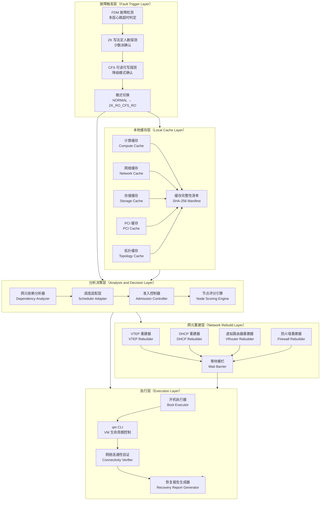

---

## 参考资料

```text
[1] Proxmox VE High Availability Manager 官方文档
    https://pve.proxmox.com/wiki/High_Availability

[2] Proxmox VE SDN（Software Defined Networking）官方文档
    https://pve.proxmox.com/wiki/SDN

[3] VMware vSphere HA 准入控制官方文档
    https://docs.vmware.com/en/VMware-vSphere/7.0/com.vmware.vsphere.avail.doc/GUID-85D9737E-769C-40B6-AB73-F58DA1A451F0.html

[4] VMware vSphere Cluster Services（vCLS）官方文档
    https://docs.vmware.com/en/VMware-vSphere/7.0/com.vmware.vsphere.resmgmt.doc/GUID-A3B80CF9-5EE7-4FC2-9B52-A0B96FF80B06.html

[5] VMware vSphere HA 故障域与亲和性规则文档
    https://docs.vmware.com/en/VMware-vSphere/7.0/com.vmware.vsphere.avail.doc/GUID-E0161CB5-BD3F-425F-A7E0-BF83B005FECA.html

[6] Brewer E.A. - Towards Robust Distributed Systems（CAP 定理原始论文）
    https://people.eecs.berkeley.edu/~brewer/cs262b-2004/PODC-keynote.pdf

[7] FRRouting BGP 实现文档（虚拟路由器重建依赖）
    https://docs.frrouting.org/en/latest/bgp.html

[8] Linux Kernel VXLAN 实现文档（VTEP 重建依赖）
    https://www.kernel.org/doc/html/latest/networking/vxlan.html

[9] inotify Linux 内核接口文档（事件驱动缓存同步依赖）
    https://man7.org/linux/man-pages/man7/inotify.7.html

[10] Raft 共识算法论文 - In Search of an Understandable Consensus Algorithm
     https://raft.github.io/raft.pdf
```

---

以上完整回答了三大核心设计问题的全部内容。

**核心结论总结如下：**

少数派调度的本质是在局部知识约束下的降级资源匹配，解决之道是构建调度适配层而非替换原有调度器，通过四维资源评估模型（计算、网络、存储、PCI）结合本地缓存与实时探活的双保险机制，在信息不完整的条件下做出"足够好"的调度决策。

网元重建的本质是将 HA 的保障边界从 VM 生命周期扩展到网络基础设施生命周期，异步任务框架与等待栅栏机制使网元重建与 VM 开机并行推进，既不阻塞 RTO，又保证 VM 开机时网络已就绪。

本地缓存与 vCenter + vCLS 的等效性不是一个"是否达到"的二元问题，而是一个 CAP 取舍下的设计选择问题：hci-vcls 以最终一致性换取了极端故障下的高可用性，在故障可用性和网元重建能力两个维度上甚至超越了 vCenter + vCLS 的能力边界。
